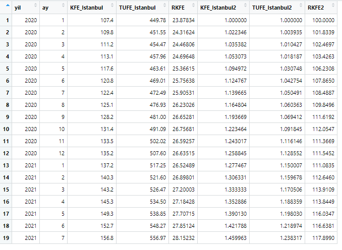
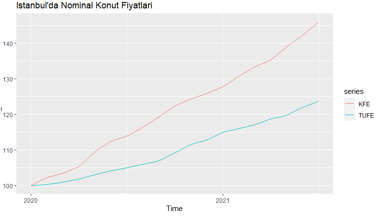
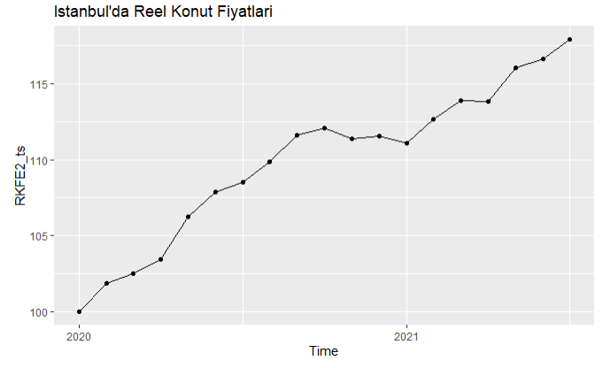
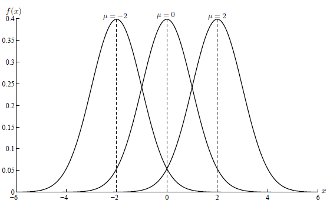
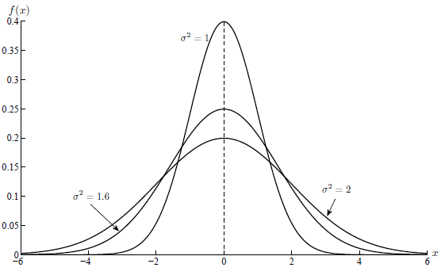

class: my-medium-font

<style type="text/css">
.remark-slide-content {
    font-size: 25px;
    padding: 1em 4em 1em 4em;
}
.my-large-font {
  font-size: 40px;
}
.my-small-font {
  font-size: 20px;
}
.my-medium-font {
  font-size: 30px;
}
</style>

```{r message=FALSE, warning=FALSE, include=FALSE}
Sys.setlocale("LC_ALL","turkish")
```


# Plan

- [Finansal Varlıklar](#fvarliklar)

- [Paranın zaman değeri, bileşik faiz](#zaman)

- [Nominal ve reel değer](#reel)

- [Finansal varlık getirileri](#getiri)

- [Getiriler ve Normal dağılım](#normal)


---
name: fvarliklar

# Finansal Varlıklar 

- Ticarete konu olan her şey bir "varlık (asset)" olarak tanımlanabilir. Örneğin, nakit (TL), yabancı para, şirket payları, tahvil ve bonolar, gayrimenkuller ve ilgili yatırım payları, vs. 

- Finansal varlıkların belirli bir süredeki getirileri tanımlanabilir. Bu getiriler faiz ve kar payı şeklinde olabilir ve genellikle varlığın başlangıçtaki değerine oranlanarak ifade edilebilir. 

- İlgili dönemde finansal varlığın fiyatında da değişme olabilir. Toplam getiri fiyat değişimi ile getirinin (yield) toplanması ile bulunabilir.   

- Risk bir finansal varlığın fiyatında ve/veya getirisindeki değişkenliği ifade eder. Örneğin cebinizdeki nakit tutuyorsanız fiyatlar genel düzeyindeki artışlar (enflasyon) sizin için bir risk faktörüdür. 

- Risksiz (risk-free) varlık var mıdır? (örneğin Amerikan tahvilleri?)


---
name: zaman 

# Paranın Zaman Değeri 

- Elimizde $D$ Türk Lirası (TL) tutarında bir fon olsun ve bunu 1 yıllığına $R$ oranıyla bankaya yatıralım (Faiz ya da getiri oranı $R$, 0 ile 1 arasında bir sayı olarak ifade edilsin, örneğin 0.1). Bir yıl sonraki nominal değer
$$GD_1 = D\times(1+R) = D + D\times R$$
olur. Bunu olduğu gibi tekrar aynı faiz oranıyla yatırırsak ikinci yılın sonunda değeri 
$$GD_2 = D\times(1+R) \times(1+R)= D \times(1+R)^2$$
olur. 

- Daha genel olarak $n$ yılın sonunda 
$$GD_n = D\times(1+R) \times(1+R)\ldots \times(1+R)= D(1+R)^n$$
olacaktır. 

---
# Örnek: 

- Faiz oranı %10 olsun, yatırım tutarı ise 10000TL olsun. 

- İlk beş yılın ve onuncu yılın sonunda gelecek değerini R programını kullanarak hesaplayalım. 
.pull-left[
```{r ex1, eval=FALSE}
D = 10000 
R = 0.1 
GD1 = D*(1 + R)  
GD2 = D*(1 + R)^2
GD3 = D*(1 + R)^3
GD4 = D*(1 + R)^4
GD5 = D*(1 + R)^5
GD10 = D*(1 + R)^10
gd <- data.frame(t = c(1,2,3,4,5,10), 
             gelecek_deger = c(GD1, GD2, GD3, GD4, GD5, GD10))
gd
```
]

.pull-right[
Yandaki komutların çıktısı: 
```{r ex1-out, ref.label="ex1", echo=FALSE}
```
]


---
# Şimdiki Değer 

- $GD_n = D(1+R)^n$ formülünden hareketle şimdiki değeri kolayca bulabiliriz: 
$$
 D =\frac{G D_{n}}{(1+R)^{n}}
$$
- Verilmiş bir $D$ ve $GD_n$ için getiri oranını da bulabiliriz: 
$$
R=\left(\frac{GD_{n}}{D}\right)^{1 / n}-1
$$

---
# Bileşik Faiz 

```{r}
C = 1    # yatırım tutarı
r = 0.12 # yıllık faiz oranı (bileşik)
m = c(1,2,4,12,52,365) # ödeme sayısı
donemlik_faiz_oranı = r/m
faiz_tipi = c("Yıllık", "Yılda iki kere", "Çeyreklik", 
              "Aylık", "Haftalık", "Günlük")
net_deger = C*(1+r/m)^m
df <- data.frame(faiz_tipi, m, donemlik_faiz_oranı, net_deger)
df
```

---
# Bileşik faiz 

$m$ arttıkça net değer $A$, $100*\exp(r)$ değerine yaklaşır. Daha genel olarak $C$ tutarında bir yatırım için net değer 
$$A = C \exp(r\times n) = Ce^{r.n}$$ 
olur. Burada $r$ bileşik faiz oranı, $n$ yıl sayısıdır. $A$ biliniyorsa şimidiki değeri hesaplamak için 
$$C = A \exp(-r\times n) = Ae^{-r.n}$$ 

---
# Bileşik getiri oranı 

- $t$ zamanındaki fiyatı $P_t$ olan bir varlığın $t-1$ zamanından $t$'ye brüt getiri oranı
$$1+R_t = \frac{P_t}{P_{t-1}}, ~~~~ R_t = \frac{P_t-P_{t-1}}{P_{t-1}}$$

- $R_t$'nin doğal logaritmasına sürekli bileşik getiri ya da log-getiri adı verilir: 
$$r_t = \ln(1+R_t) = \ln \frac{P_t}{P_{t-1}} = \ln P_t - \ln P_{t-1}$$

- $P_t$ hisse senedinin fiyatı ise ve $t$ zamanında $D_t$ tutarında bir kar payı ödemesi yapılmışsa, basit ve bileşik getiri oranları aşağıdaki formüllerle hesaplanabilir: 
$$R_t = \frac{P_t + D_t}{P_{t-1}}-1$$
$$r_t = \ln (P_t + D_t) - \ln (P_{t-1})$$


---
name: reel

# Nominal ve reel değer 

- Nominal fiyatlardan enflasyonun etkisini arındırmak için deflate etmemiz gerekir: 
$$reel~fiyat_t = \frac{Nominal~fiyat_t}{Deflatör_t}$$
- Burada deflatör genellikle bir fiyat endeksi olarak tanımlanır (TÜFE gibi)

- Örnek: İstanbul'da 2020-Ocak-2021-Temmuz döneminde konut fiyat endeksi (baz yılı 2017=100) ve Tüketici fiyat endeksi (baz yılı 2003=100)

- 2021 yılı Ocak ayında konut fiyat endeksi (KFE) 107.40 değerinden 2021 yılı Temmuz ayında 156.80 değerine ulaşmıştır. Nominal fiyat artışı 
$$100\times\frac{156.80-107.40}{107.40}= 45.99628$$
yaklaşık %46'dır. 


---
# İstanbul'da Reel Konut Fiyatları


- Aynı dönemde TÜFE'deki artış ise 
$$100\times\frac{556.97-449.78}{449.78}= 23.83165$$
yaklaşık % 23.8 olmuştur. 

- Reel konut fiyat artışı için 2020-Ocak ayında deflate edilmiş **KFE = 100*(107.40/449.78) = 23.87834**, 2021-Temmuz ayında deflate edilmiş **KFE = 100*(156.8/556.97) = 28.15232** olur. 

- Reel artış buradan 
$$100\times\frac{28.15232-23.87834}{23.87834}= 17.89898$$

yaklaşık %17.9 olarak bulunur. 

---
# İstanbul'da Reel Konut Fiyatları
```{r echo=TRUE}
yil <- c(rep(2020,12), rep(2021,7))
ay <- c(1:12,1:7)
KFE_Istanbul <- c(107.40, 109.80, 111.20, 113.10, 117.60, 120.80, 122.40, 125.10, 
                  128.20, 131.40, 133.50, 135.20, 137.20, 140.30, 143.20, 145.30,
                  149.30, 152.70, 156.80)
KFE_Istanbul2 <- KFE_Istanbul/107.4
TUFE_Istanbul <- c(449.78, 451.55, 454.47, 457.96, 463.61, 469.01, 472.49, 476.93, 
                   481.00, 491.09, 502.02, 507.60, 517.25, 521.60, 526.47, 534.50,
                   538.85, 548.27, 556.97)
TUFE_Istanbul2 <- TUFE_Istanbul/449.78
RKFE <- 100*KFE_Istanbul/TUFE_Istanbul
RKFE2 <- 100*KFE_Istanbul2/TUFE_Istanbul2
KFE <- data.frame(yil, ay, KFE_Istanbul, TUFE_Istanbul, RKFE, KFE_Istanbul2, TUFE_Istanbul2, RKFE2)
```

---
# İstanbul'da Reel Konut Fiyatları




---
# İstanbul'da KFE ve TUFE 

```{r message=FALSE, warning=FALSE, include=FALSE}
library(forecast)
library(ggplot2)
KFE_ts <- ts(KFE_Istanbul2, start = c(2020,1), frequency = 12)
TUFE_ts <- ts(TUFE_Istanbul2, start = c(2020,1), frequency = 12)
autoplot(KFE_ts*100, series = "KFE") + 
  autolayer(TUFE_ts*100, series = "TUFE") +  
  labs(title = "İstanbul'da Nominal Konut Fiyatları")
```




---
# İstanbul'da Reel Konut Fiyatları

```{r message=FALSE, warning=FALSE, include=FALSE}
library(forecast)
library(ggplot2)
RKFE2_ts <- ts(RKFE2, start = c(2020,1), frequency = 12)
autoplot(RKFE2_ts)+geom_point() +
  labs(title = "İstanbul'da Reel Konut Fiyatları")
```




---
name: getiri 

# Finansal getiriler

- Varlık getirilerini daha önce tanımlamıştık. 

- Basit getiri varlığın şimdiki değeri ile geçmişteki değerleri arasındaki fark olarak tanımlanır. Örneğin $t$ zamanındaki fiyat ile $t-1$, yani bir dönem önceki fiyat arasındaki fark olarak tanımlanır: 
$d_t = P_t-P_{t-1}$

- Göreli getiri varlık fiyatında belirli bir dönemde meydana gelen değişmenin dönem başındaki değere oranıdır. Örneğin $t-1$'den $t$'ye 1 dönemdeki göreli getiri
$$R_t = \frac{P_t-P_{t-1}}{P_{t-1}}$$

- Logaritmik getiri ise varlık fiyatının logaritmik farkı olarak tanımlamıştık. Örneğin 
$$r_t = \ln (P_t) - \ln (P_{t-1}) \approx \frac{P_t-P_{t-1}}{P_{t-1}}$$
Göreli getiri ve log getiriler 100 ile çarpılarak yüzde olarak da ifade edilebilir. 

---
# Örnek: BIST100 tarihsel getiriler
.pull-left[
```{r message=FALSE, warning=FALSE}
library(xts)
load("../R/Data/bist100xts.rda")
head(BIST100, 5) # ilk 5 gözlem
tail(BIST100, 5) # son 5 gözlem
```
]

.pull-right[
```{r message=FALSE, warning=FALSE}
plot(BIST100)
```
] 

---
# Örnek: BIST100 tarihsel getiriler

.pull-left[
2003-2018 yılları arasına bakalım: 
```{r message=FALSE, warning=FALSE}
BIST100_2003_2018 <- BIST100["2003/2018"] 
tail(BIST100_2003_2018, 5) # son 5 gözlem
```
]

.pull-right[
```{r message=FALSE, warning=FALSE}
plot(BIST100_2003_2018)
```
]

---
# Örnek: BIST100 tarihsel getiriler
.pull-left[
```{r message=FALSE, warning=FALSE}
# 1 günlük basit getiriler (birinci farklar) 
basit_getiri <- diff(BIST100)
head(basit_getiri, 5) # ilk 5 gözlem
tail(basit_getiri, 5) # son 5 gözlem
```
]

.pull-right[
```{r message=FALSE, warning=FALSE}
plot(basit_getiri)
```
] 

---
# Örnek: BIST100 tarihsel getiriler
.pull-left[
```{r message=FALSE, warning=FALSE}
# 1 günlük göreli getiriler
lag1 <- lag(BIST100, 1) # birinci gecikme
head(lag1, 4)
goreli_getiri <- (BIST100 - lag1)/lag1
head(goreli_getiri, 4)
```
]

.pull-right[
```{r message=FALSE, warning=FALSE}
plot(goreli_getiri)
```
] 

---
# Örnek: BIST100 tarihsel getiriler
.pull-left[
```{r message=FALSE, warning=FALSE}
# 1 günlük logaritmik getiriler
log_bist <- log(BIST100)
log_getiri <- log_bist - lag(log_bist, 1)
head(log_getiri)
```
100 ile çarpılarak yüzde olarak da ifade edilebilir. 
]

.pull-right[
```{r message=FALSE, warning=FALSE}
plot(log_getiri)
```
] 

---
# Örnek: BIST100 tarihsel getiriler
.pull-left[
```{r message=FALSE, warning=FALSE}
# 1 günlük yüzde getiriler
log_getiri100 <- 100*(log_bist - lag(log_bist, 1))
head(log_getiri100)
``` 
]

.pull-right[
```{r message=FALSE, warning=FALSE}
plot(log_getiri100)
```
] 

---
# Getirilerin toplulaştırılması 

- Günlük logaritmik getirilerden hareketle haftalık ya da aylık getiriler hesaplanabilir. 

- $r_t$ günlük varlık fiyatlarından hareketle hesaplanan log getiri olsun. 5 günlük log getirileri hesaplamak istersek 
$$\ln (P_{t-5}) - \ln (P_{t})=\sum_{i=1}^5r_{t+i}$$
ilgili dönem içindeki günlük log getirileri toplamamız yeterli olur. 

- Benzer şekilde aylık getirileri hesaplamak istersek o ay içindeki günlük logaritmik getirileri toplayabiliriz. 


---
# Örnek: BIST100 haftalık ve aylık getiriler 
.pull-left[
```{r message=FALSE, warning=FALSE}
# haftalık log getiriler
log_getiri100_h <- apply.weekly(log_getiri100, sum)
head(log_getiri100_h, 4)
tail(log_getiri100_h, 4)
``` 
]

.pull-right[
```{r message=FALSE, warning=FALSE}
plot(log_getiri100_h)
```
] 

---
# Örnek: BIST100 haftalık ve aylık getiriler 
.pull-left[
```{r message=FALSE, warning=FALSE}
# aylık log getiriler
log_getiri100_a <- apply.monthly(log_getiri100, sum)
head(log_getiri100_a, 4)
tail(log_getiri100_a, 4)
``` 
]

.pull-right[
```{r message=FALSE, warning=FALSE}
plot(log_getiri100_a)
```
] 


---
name: normal 

# Normal Dağılım 

- Finansta kullanılan bazı modeller (örneğin Black-Scholes) varlık fiyatlarının geometrik Brownian Motion sürecini takip ettiğini varsayar. 

- Bu varsayım altında log getiriler normal dağılıma uyar ve bağımsızdır. 

- Eğer rassal değişken $X$ normal dağılımı uyuyorsa, yani $X\sim~N(\mu,~\sigma^2)$ ise, bu dağılımı ortalama $\mu$ ve varyans $\sigma^2$ ile betimleyebiliriz. 

- $\mu$ dağılımın merkezini gösteren lokasyon parametresidir. 

- $\sigma^2$ ise merkez çevresindeki değişkenliği gösteren varyans parametresidir. 

- Veriler ortalama çevresinde çan eğrisi biçiminde ve simetrik dağılır. Verilerin yaklaşık $\%95$'i 2 standart sapma ( $\sigma$ ) içinde yer alır.  

- Acaba log getiriler gerçekten de normal dağılıma uyuyor mu? Bunun için görsel araçlar ya da hipotez testlerini kullanabiliriz. 

---
# Normal dağılım
Normal dağılımın parametreleri: ortalama ve varyans
.pull-left[

Farklı ortalamalar, aynı varyans: bu durumda normal dağılım şeklini bozmadan sağa ve sola kayar. 
]

.pull-right[

Farklı varyanslar, aynı ortalama: bu durumda varyans arttıkça dağılım daha yayvan/yayık hale gelir. Merkez (ortalama) aynı kalır. 
] 

---
# Normal dağılım
.pull-left[ 
```{r echo=FALSE}
knitr::include_graphics("img/norm1.PNG")
```

$Z\sim~N(0,1)$: ortalaması 0 ve varyansı 1 olan normal dağılımın histogramı ve yoğunluk fonksiyonu tahmini (kırmızı çizgi)
]

.pull-right[
```{r echo=FALSE}
knitr::include_graphics("img/norm2.PNG")
```
x-ekseninde teorik kantiller y-ekseninde z değişkeninin kantilleri gösterilmiştir. Noktaların çizgi üzerinde hizalanması verilerin dağılımının normal dağılıma uyduğunu gösterir. 
] 


---
# 2003 sonrası BIST100 getirileri 
 02/01/2003 - 29/09/2021 arası günlük getirilerin histogramı ve QQ grafiği. Bu dönemde ortalama günlük getiri %0.0553 standart sapma ise 1.6876 olarak gerçekleşti. 
.pull-left[ 
```{r echo=FALSE}
knitr::include_graphics("img/norm5.PNG")
```
Günlük getiriler normal dağılıma göre daha sivri bir dağılıma sahip. Ekstrem değerlerin gerçekleşme olasılığı daha yüksek
]

.pull-right[
```{r echo=FALSE}
knitr::include_graphics("img/norm6.PNG")
```
Getiri dağılımı normal dağılım ile örtüşmüyor. Özellikle kuyruklarda farklılıklar var. Getiri dağılımı daha kalın kuyruklu. 
] 

---
# Getirilerin dağılımı 

- Varlık getirileri normal dağılıma uymayabilir. Getirilerin dağılımı genellikle normal dağılıma göre daha kalın kuyruklu (leptokurtic) olur. 

- Dağılımın simetrisini **skewness** katsayısı ile basıklığını ise **kurtosis** katsayısı ile ölçebiliriz. Normal dağılım için skewness=0, kurtosis=3 değerini alır. 

- Getiri dağılımında kurtosis>3 ise kuyruklar normale göre daha kalındır (leptokurtosis). 

- Bu nedenle getirilerin modellenmesinde, normal dağılıma göre daha kalın kuyruklu dağılımların  kullanılması önerilmiştir (örneğin t dağılımı)

- Normallik sınamaları için çok sayıda test geliştirilmiştir. Bunları daha sonra göreceğiz. 

- Ayrıca getiri serilerinin özelliklerini daha detaylı olarak inceleyeceğiz. Getirilerin geçmiş değerlerden hareketle öngörülebilir olup olmadığını izleyen derslerde ele alacağız. 


