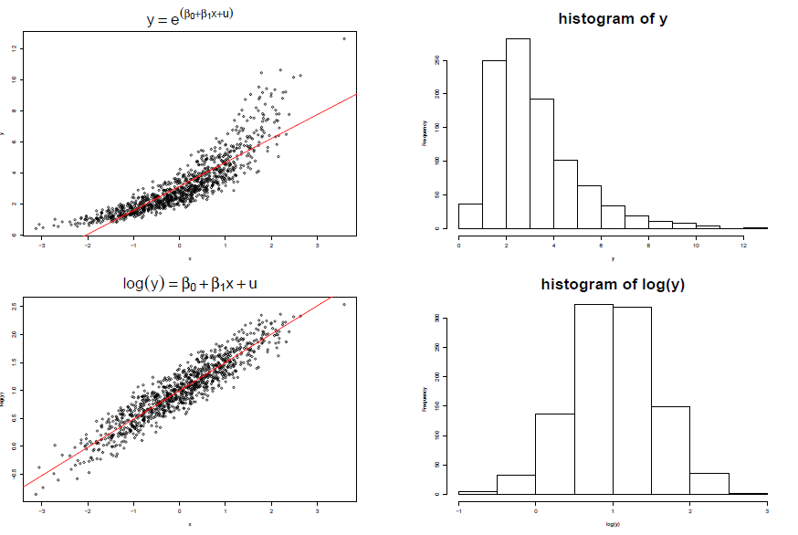

class: my-medium-font

<style type="text/css">
.remark-slide-content {
    font-size: 25px;
    padding: 1em 4em 1em 4em;
}
.my-large-font {
  font-size: 40px;
}
.my-small-font {
  font-size: 20px;
}
.my-medium-font {
  font-size: 30px;
}
.left-column {
  width: 75%;
  float: left;
  padding-top: 1em;
}
.right-column {
  width: 25%;
  float: right;
  padding-top: 1em;
}
</style>


# Plan

- [Basit regresyon modeli](#basit)

- [Ceteris Paribus nosyonu](#cetpar)

- [Popülasyon regresyon fonksiyonu](#prf)

- [Sıradan En Küçük Kareler Tahmini](#ols)

- [Regresyonun açıklama gücü](#r2)

- [Doğrusal olmama](#nonlinear)

- [Anlamlılık sınaması](#ttest)

---
name: basit 

# Tek açıklayıcı değişkenli (basit) regresyon modeli 
$$y = \beta_0 + \beta_1 x + u$$

- $y$: bağımlı değişken

- $x$: açıklayıcı değişken

- İki değişkenli regresyon modeli (bivariate regression model), tek açıklayıcı 
değişkenli model, basit regresyon modeli (simple regression model)

- Amaç: bağımlı değişken $y$'yi, bağımsız değişken $x$ ile açıklamak. 

- Regression teriminin orijini: Galton'un ortalamaya dönüş (regress) yasası
    
    


---
# Rassal hata terimi 

Basit Regresyon Modeli: 
$$y = \beta_0 + \beta_1 x + u$$

- Rassal Hata Terimi: $u$ (Error term - Disturbance term), Bağımlı değişken $y$ üzerinde etkili olan $x$'in dışındaki diğer faktörleri (modelde yer almayan olası tüm değişkenler) temsil eder.

- Bu diğer etkenlere gözlenemeyen (unobserved) faktörler denir.

- Eğer $u$'da yer alan diğer faktörler sabit tutulursa, yani $\Delta u = 0$ kabul edilirse $x$'in $y$ üzerindeki etkisi aşağıdaki gibi bulunabilir:
$$ \Delta y = \beta_1 \Delta x$$

- Eğim katsayısı $\beta_1$: Diğer faktörler sabitken (ceteris paribus) $x$'deki bir birim değişmenin $y$'de yaratacağı değişimi gösterir. 

- Sabit terim (intercept) $\beta_0$: $x=0$ iken $y$'nin alacağı değeri gösterir.


---
# Örnek: Eğitim düzeyi ve saatlik ücretler 

$$ ücret = \beta_0 + \beta_1 eğitim + u$$
ücret: saat başına ücretler (dolar); eğitim: eğitim düzeyi (yıl)

- Eğim Katsayısı $\beta_1$'in yorumu
$$\Delta ücret = \beta_1 \Delta eğitim$$
Ceteris Paribus eğitim düzeyindeki 1 yıllık değişim, saat başına ücretleri ortalamada $\beta_1$ \$ kadar değiştirir. 

- Rassal hata terimi $u$: Ücretleri etkileyen eğitim dışındaki diğer tüm gözlenemeyen faktörleri temsil eder. Emek piyasasındaki tecrübe (yıl), doğuştan gelen yetenek, şu an çalışılan yerdeki kıdem, iş etiği, alınan eğitimin kalitesi, çalışanın cinsiyeti, etnik kökeni, kır ya da kente yaşaması, medeni hali, çocuk sayısı, dış görünüşü vs. gibi çok sayıda faktör ücretleri etkileyebilir. 


---

# Örnek: Eğitim düzeyi ve saatlik ücretler 


```{r eval=FALSE, message=FALSE, warning=FALSE, include=FALSE}
library(tidyverse)
library(wooldridge)
wage <- as_tibble(wage1)
wage %>% ggplot(aes(educ,wage)) +
  geom_point(alpha=0.2) + 
  scale_x_continuous(breaks=c(0:18)) + 
  labs(x="Eğitim düzeyi", 
       y="Ücret", 
       title="Eğitim düzeyi ve saat başına ücretler") + 
  theme_bw()
```

```{r, echo=FALSE, out.width = "75%", fig.align='center'}
knitr::include_graphics("img/educ-wage-plot1.png")
``` 

---
# Koşullu dağılım

- 12 yıl eğitim düzeyine sahip olanların ücret dağılımı, $f(ücret|eğitim=12)$

```{r eval=FALSE, message=FALSE, warning=FALSE, include=FALSE}
wage %>% filter(educ==12) %>% 
  ggplot(aes(wage))+
  geom_histogram(bins = 12, color = "darkblue", fill = "lightblue") + 
  labs(x="Ücret", 
       y="Sıklık", 
       title="12 yıllık eğitim düzeyine sahip olanların ücret histogramı") + 
  theme_bw()
```

```{r, echo=FALSE, out.width = "70%", fig.align='center'}
knitr::include_graphics("img/educ-wage-plot2.png")
``` 


---
# Düzleştirilmiş histogram

- 12 yıl ve 16 yıl eğitim düzeyine sahip olanların ücret dağılımlarını karşılaştıralım. 

.pull-left[
```{r eval=FALSE, message=FALSE, warning=FALSE, include=FALSE}
wage_subset <- wage %>% filter(educ==12|educ==16) %>% 
  select(educ, wage)
wage_subset %>% ggplot(aes(wage,color = factor(educ))) +
  geom_density() +
  labs(x="Ücret", 
       y="Yoğunluk", 
       title="Koşullu dağılım") +
  theme_bw()
```

```{r, echo=FALSE, out.width = "100%", fig.align='center'}
knitr::include_graphics("img/educ-wage-plot3.png")
``` 
]
.pull-right[
- 12 yıl eğitime sahip olanlarda medyan ücret 4.5 USD, ortalama ücret = 5.37

- 16 yıl eğitime sahip olanlarda medyan ücret=6.29, ortalama ücret = 8.042
]


---
# Doğrusallık 

- Basit regresyonun doğrusal (linear) olması şu anlama gelmektedir: $x$'deki 1 birimlik değişmenin $y$'de meydana getireceği etki, $x$'in başlangıç (initial) değeri ne olursa olsun, aynıdır (sabittir).

- Bu sabit etki varsayımı uygulamada çoğu zaman gerçeklere uymaz. 

- Örneğin, ölçeğe göre artan ya da azalan getiri doğrusal modelle açıklanamaz. 

- Ücret denkleminde, ilave bir yıl eğitimin etkisi önceki eğitim düzey(ler)ine göre daha fazla olacaktır.

- Benzer şekilde tecrübe düzeyi ücretler üzerinde önce artan sonra azalan bir etkiye sahip olabilir.

- Basit dönüştürmeler kullanarak (örneğin doğal logaritma) bazı doğrusal olmayan etkileri kolayca modellemek mümkündür. 

---
name: cetpar 

# Ceteris Paribus çıkarımları için gerekli varsayımlar

**Hata teriminin anakütle ortalamasının sıfır olması**

- Basit regresyonda sabit terim ( $\beta_0$ ) mevcut olduğu sürece şu varsayımı yapabiliriz:
$$E(u)=0$$ 

- Bu varsayım, $u$'nun içerdiği gözlenemeyen (unobservables) etkilerin dağılımıyla ilgili bir varsayımdır. 

- $u$'ların bir kısmı $+$, bir kısmı $-$ işaretlidir ve bunlar birbirlerini götürürler diye varsayıyoruz.

- $\beta_0$'ı yeniden tanımlayarak bu varsayımın gerçekleşmesini her zaman sağlayabiliriz. 


---
# Ceteris Paribus  için gerekli varsayımlar

**Hata terimi $u$ ile açıklayıcı değişken $x$'in ilişkisiz olması koşulu**

- $x$'in $y$ üzerindeki etkisini görebilmemiz için $u$'da içerilen gözlenemeyen faktörlerin aynı (sabit) kalmaları (ceteris paribus koşulu) gerekli idi. Bundan nasıl emin olabiliriz?

- Bunun için $x$ ile $u$'nun ilişkisiz olması gereklidir. Ancak, $u$ hem $x$ ile, hem de $x$'in herhangi bir fonksiyonu (örneğin $x^2$, $\sqrt{x}$ vs.) ile ilişkisiz olmalı.

- Bunun için **Sıfır Koşullu Ortalama** varsayımını yapmamız gerekmektedir:
$$E(u|x) = E(u) = 0$$


---
# Sıfır Koşullu Ortalama Varsayımı


**Hata terimi $u$ ile açıklayıcı değişken $x$'in ilişkisiz olması koşulu**
$$E(u|x) = E(u) = 0$$

- Burada $u$ ve $x$ tesadüfi değişkenlerdir (random variables). Bu nedenle, $x$'in verilen herhangi bir değeri için $u$'nun koşullu dağılımını tanımlayabiliriz.

- $x$'in verilen belli bir değerine anakütlenin (population) belli bir dilimi (kısmı) karşılık gelir. Buradan hareketle $u$'nun bu populasyon dilimi içindeki beklenen değerini (ortalamasını) alabiliriz.

- Burada kritik varsayım, $u$'nun ortalama değerinin $x$'in alacağı değere bağlı olmamasıdır.

- $x$'in verilen herhangi bir değeri için gözlenemeyen faktörlerin ortalaması aynıdır ve dolayısıyla da $u$'nun tüm anakütledeki ortalama değerine (sıfıra) eşittir.


---
# Örnek 

**Ücret Denklemi**:
$$ücret = \beta_0 + \beta_1 eğitim + u$$

- Bu regresyonda $u$ doğrudan gözlenemeyen/ölçülemeyen çalışanların doğuştan gelen yeteneğini içersin. Bunu yetenek değişkeni ile gösterelim.

- $E(u|x)$ varsayımı tüm eğitim seviyelerinde doğuştan gelen yeteneğin aynı olduğunu söyler. Yani koşullu dağılım ortalamaları: 
$$E(yetenek|eğitim=8) = E(yetenek|eğitim=12) =\ldots = 0$$

- Eğer eğitimle doğuştan yeteneğin ilişkili olduğunu düşünüyorsak (daha yetenekliler okulda da daha iyiler), bu halde varsayım sağlanamaz.

- Doğuştan yeteneği gözlemleyemediğimiz için de ortalama doğuştan yeteneğin tüm eğitim seviyelerinde aynı olup olmadığını bilemeyiz. 


---
name: prf

# Popülasyon (Anakütle) Regresyon Fonksiyonu (PRF)

- Basit regresyon modelinde $y$'nin $x$'e göre koşullu beklenen değerini alalım:
$$\begin{aligned}E(y|x)  & = \beta_0 + \beta_1 x + \underbrace{E(u|x)}_{=0} \\              & =  \beta_0 + \beta_1 x \end{aligned}$$

- Buna PRF adı verilir. Açıktır ki, bağımlı değişkenin koşullu beklenen değeri $x$'in doğrusal bir fonksiyonudur.

- PRF'nin doğrusallığı: $x$'deki 1 birimlik değişime karşılık $y$'nin koşullu beklenen değeri (koşullu ortalaması) $\beta_1$ kadar değişmektedir.

- Verilmiş bir $x$ düzeyinde $y$'nin dağılımının merkezi $E(y|x)$'dir. 

---
# Popülasyon (Anakütle) Regresyon Fonksiyonu (PRF)

```{r, echo=FALSE, out.width = "70%", fig.align='center'}
knitr::include_graphics("img/PRF1.png")
``` 
 


---
name: ols

# Tahmin problemi

- Bilinmeyen popülasyon parametreleri ( $\beta_0,\beta_1$ ) verilerden hareketle nasıl tahmin edilebilir?

- Popülasyondan $n$ gözlemli (hacimli) bir rassal örneklem (random sample) çektiğimizi düşünelim:
$$\{y_i,x_i:i=1,2,\ldots,n\}$$

- Regresyon modelini herbir gözlem için aşağıdaki gibi yazabiliriz:
$$y_i = \beta_0 + \beta_1 x_i + u_i,~~~i=1,2,\ldots,n$$

- Bu durumda elimizde iki bilinmeyenli $n$ denklem olacaktır.

---
#  Anakütle Katsayılarının Tahmini

- Gözlemlerle endekslenmiş model:

$$y_i = \beta_0 + \beta_1 x_i + u_i,~~~i=1,2,\ldots,n$$

- İki bilinmeyenli $n$ denklem:
$$\begin{eqnarray*}y_1 &=& \beta_0 + \beta_1 x_1 + u_1 \\
    y_2 &=& \beta_0 + \beta_1 x_2 + u_2 \\
    y_3 &=& \beta_0 + \beta_1 x_3 + u_3 \\
    \vdots &=& \vdots \\
    y_n &=& \beta_0 + \beta_1 x_n + u_n
  \end{eqnarray*}$$


---
# Sıradan En Küçük Kareler Yöntemi
- $y$'nin modelce tahmin edilen değerleri (fitted values):
$$\hat{y}_i = \hat{\beta}_0 + \hat{\beta}_1 x_i$$

- Kalıntı (residual) terimleri gözlenen ile tahmin edilen $y$ değerleri arasındaki farktır:
$$\begin{eqnarray*}\hat{u}_i &=& y_i - \hat{y}_i \\
     &=& y_i -  \hat{\beta}_0 - \hat{\beta}_1 x_i
 \end{eqnarray*}$$
 
- Kalıntı terimi, hata terimi ile karıştırılmamalıdır. $u$ gözlenemeyen bir rassal değişkendir. $\hat{u}$ ise modelce tahmin edilen bir büyüklüktür.

- **OLS-SEKK amaç fonksiyonu**: OLS (OLS = Ordinary Least Squares) yöntemi kalıntı kareleri toplamını en küçük yapacak şekilde tahmincileri seçer:
$$\min_{\hat{\beta}_0, \hat{\beta}_1} SSR = \sum_{i=1}^n \hat{u}_i^2=\sum_{i=1}^n(y_i -  \hat{\beta}_0 - \hat{\beta}_1 x_i)^2$$

---
# OLS-SEKK amaç fonksiyonu

- OLS yöntemi kalıntı kareleri toplamını (SSR) en küçük yapacak şekilde tahmincileri seçer:
$$\min_{\hat{\beta}_0, \hat{\beta}_1} SSR = \sum_{i=1}^n (y_i -  \hat{\beta}_0 - \hat{\beta}_1 x_i)^2$$ 

- OLS birinci sıra koşulları
$$\begin{eqnarray*}
  \frac{\partial SSR}{\partial \hat{\beta}_0 } &=& -2 \sum_{i=1}^n (y_i - \hat{\beta}_0 - \hat{\beta}_1 x_i) = 0  \\
  \frac{\partial SSR}{\partial \hat{\beta}_1 } &=& -2 \sum_{i=1}^n x_i(y_i - \hat{\beta}_0 - \hat{\beta}_1 x_i) = 0
\end{eqnarray*}$$

- Birinci sıra koşullarından elde edilen iki bilinmeyenli iki denklemli sistem belirli şartlar altında çözülebilir. 

---
# OLS tahmincileri 

- Eğim Katsayısının Tahmincisi
$$\hat{\beta}_1 = \frac{\sum_{i=1}^n (x_i - \bar{x})(y_i - \bar{y})}{\sum_{i=1}^n (x_i - \bar{x})^2}$$ 

- Eğim katsayısı tahmincisi $x$ ile $y$'nin örneklem kovaryansının, $x$'in örneklem varyansına oranıdır.

- $\hat{\beta}_1$'nın işareti örneklem kovaryansının işaretine bağlıdır. Eğer örneklemde $x$ ile $y$ aynı yönde ilişkiliyse $\hat{\beta}_1$ pozitif işaretli, ters yönde ilişkiliyse negatif işaretli olacaktır.

- $\hat{\beta}_1$'nın hesaplanabilmesi için $x$'de yeterli değişkenlik olmalıdır:
$\sum_{i=1}^n (x_i - \bar{x})^2>0$

- Eğer örneklemde tüm $x$'ler aynı değerleri alıyorsa örneklem varyansı 0 olur. Bu durumda $\hat{\beta}_1$ tanımsız olur. Örneğin, ücret denkleminde tüm çalışanlar 12 yıllık eğitim düzeyine sahipse eğitimin ücretler üzerindeki etkisi hesaplanamaz. 


---
# Popülasyon ve Örneklem Regresyon Fonksiyonları

- Popülasyon Regresyon Fonksiyonu - PRF (pratikte bilinmez)
$$E(y|x) = \beta_0 + \beta_1 x$$

- Örneklem Regresyon Fonksiyonu (Sample Regression Function - SRF)
$$\hat{y} = \hat{\beta}_0 + \hat{\beta}_1 x$$
SRF, PRF'nin bir tahmini olarak düşünülebilir. SRF verilere bağlı olarak değişir. 

- Eğim katsayısının yorumu:
$$\hat{\beta}_1 = \frac{\Delta \hat{y}}{\Delta x}$$
ya da
$$\Delta \hat{y} = \hat{\beta}_1 \Delta x$$


---
# Basit Regresyon Örnek: CEO Maaşları ve Karlılık

- Firma performansı ile yöneticilerin kazançları arasındaki ilişkiyi ölçmek istiyoruz. Model:
$$salary = \beta_0 + \beta_1 roe + u$$

- Değişken tanımları: salary= yıllık yönetici maaşları (1000 US$), roe= son üç yıla ait sermaye karlılık oranı (return on equity), 

- $n=209$ firma verisinden hareketle SRF aşağıdaki gibi tahmin ediliyor:
$$\widehat{salary} = 963.191 + 18.501 roe$$

- $\hat{\beta}_1 = 18.501$. Yorum: Sermaye karlılık oranındaki %1 puanlık artış ortalama yönetici maaşlarını yaklaşık 18.501 birim, yani 18,501 USD arttırır (ceteris paribus). 


---
# CEO ve karlılık oranları 

**Örneklem regresyon doğrusu ve serpilme çizimi**
```{r, echo=FALSE, out.width = "80%", fig.align='center'}
knitr::include_graphics("img/salary1.png")
``` 


---
# CEO ve karlılık oranları 

**Popülasyon ve Örneklem regresyon fonksiyonları**
```{r, echo=FALSE, out.width = "70%", fig.align='center'}

``` 


---
#  OLS (SEKK) Tahmin Edicilerinin Cebirsel Özellikleri

- OLS kalıntılarının toplamı ve dolayısıyla da örnek ortalaması sıfıra eşittir:
$$\sum_{i=1}^n \hat{u}_i = 0,~~~~~\bar{\hat{u}} = 0$$ 

- Açıklayıcı değişken $x$ ile kalıntı terimleri arasındaki örneklem kovaryansı sıfırdır:
$$\sum_{i=1}^n x_i\hat{u}_i = 0$$

- $(\bar{x},\bar{y})$ noktası daima OLS regresyon doğrusu üzerine düşer.

- Tahmin edilen $y$ değerlerinin ortalaması, gözlenen $y$ değerlerinin ortalamasına eşittir: $\bar{y}=\bar{\hat{y}}$ 

---
name: r2

# Kareler Toplamları (Sum of Squares)

- Her bir $i$ gözlemi için $y_i = \hat{y}_i + \hat{u}_i$, her iki tarafın örneklem ortalamalarından farklarının karesini alıp toplarsak aşağıdaki büyüklükleri elde ederiz:

- Toplam Kareler Toplamı (SST: Total Sum of Squares)
$$SST = \sum_{i=1}^n (y_i -\bar{y})^2$$

- Açıklanan Kareler Toplamı (SSE: Explained Sum of Squares)
$$SSE = \sum_{i=1}^n (\hat{y}_i -\bar{y})^2$$

- Kalıntı Kareleri Toplamı (SSR: Residual Sum of Squares)
$$SSR = \sum_{i=1}^n \hat{u}_i^2$$


---
# Kareler Toplamları (Sum of Squares)

- SST $y$'deki toplam değişkenliği verir.
$$SST = \sum_{i=1}^n (y_i -\bar{y})^2$$
Hatırlatma: $Var(y) = SST/(n-1)$ 

- Benzer şekilde SSE modelce açıklanan kısımdaki değişkenliği verir.
$$SSE = \sum_{i=1}^n (\hat{y}_i -\bar{y})^2$$

- SSR ise kalıntılardaki değişkenliğin bir ölçütüdür.
$$SSR = \sum_{i=1}^n \hat{u}_i^2$$

- $y$'deki toplam değişkenlik: $SST = SSE + SSR$


---
# Uyum İyiliği (Goodness-of-fit)

- Tanım gereği $y$'deki toplam değişkenlik aşağıdaki gibi yazılabilir:
$$SST = SSE + SSR$$

- Bu ifadenin her iki tarafını SST'ye bölersek:
$$1 = \frac{SSE}{SST} + \frac{SSR}{SST}$$

- Açıklanan kısmın değişkenliğinin toplam değişkenlik içindeki payı regresyonun determinasyon (belirlilik) katsayısıdır ve $R^2$ ile gösterilir:
$$R^2 = \frac{SSE}{SST} = 1 - \frac{SSR}{SST}$$
- SSE hiç bir zaman SST'den büyük olamayacağı için $0\leq R^2 \leq 1$
- $R^2$ $y$'deki değişkenliğin $x$ tarafından açıklanan kısmının yüzdesini verir. Regresyonun açıklama gücü yükseldikçe $R^2$ 1'e yaklaşır. $R^2$ şu şekilde de hesaplanabilir: $R^2 = Corr(y,\hat{y})^2$ 

---
name: nonlinear

# Regresyon modelinin doğrusallığı
$$y = \beta_0 + \beta_1 x + u$$

- $y$: bağımlı değişken, - $x$: açıklayıcı değişken

- Doğrusallık varsayımı bazı durumlarda kısıtlayıcı olabilir. 

- Değişkenlerin uygun dönüştürmelerini kullanarak bu doğrusal olmayan ilişkileri yakalayabiliriz. 

- Bu durumda model hala parametrelerde doğrusal olacaktır. 

- En yaygın kullanılan dönüştürmeler (doğal) logaritma dönüştürmesi, karesel veya kübik terimler (genel olarak polinomlar), ters kalıp, vb.
    
    


---
# Doğrusal olmama

.left-column[ 
```{r, echo=FALSE, out.width = "100%", fig.align='center'}
knitr::include_graphics("img/fkaliplar.png")
``` 
 
]
.right-column[
- Kırmızı çizgi: tahmin edilen regresyon doğrusu. 

- Hangi modeller uygun?
]


---
# Log-level 

.left-column[
```{r, echo=FALSE, out.width = "100%", fig.align='center'}

```
]
.right-column[
- Orijinal model: $y = \exp(\beta_0 + \beta_1 x + u)$

- Doğal logaritma dönüştürmesi: $\log y = \beta_0 + \beta_1 x + u$

- $\beta_1$'in yorumu: $x$ değişkenindeki 1 birim değişime karşılık $y$'de tahmin edilen değişim $\%(100\beta_1)$'dir. Not: $100\Delta\log y = \%\Delta y$
]
---
# Level-log

.left-column[
```{r, echo=FALSE, out.width = "100%", fig.align='center'}
knitr::include_graphics("img/levellog.png")
```
]
.right-column[
- Dönüştürülmüş model: $y = \beta_0 + \beta_1 \log x + u$

- $\beta_1$'in yorumu: $x$'deki %1 değişime karşılık $y$'de tahmin edilen değişim $(\beta_1/100)$ birimdir ( $y$'nin ölçü birimi cinsinden).
]


---
# Log-log (Sabit esneklik modeli)

.left-column[
```{r, echo=FALSE, out.width = "90%", fig.align='center'}
knitr::include_graphics("img/loglog.png")
``` 
]
.right-column[
- Dönüştürülmüş model: $\log y = \beta_0 + \beta_1 \log x + u$

- $\beta_1$'in yorumu: $x$'deki %1 değişime karşılık $y$'de tahmin edilen değişim % $\beta_1$ kadardır. 

- $\beta_1$ = $y$'nin $x$'e göre esnekliği. 
]


---
# OLS Tahmincilerinin Standart Hataları

- Basit regresyon modelinde $Var(u)=\sigma^2$ varsayımı altında (hata varyansının sabit olması) standart hatalar aşağıdaki formüllerden hareketle hesaplanabilir. 

$$\operatorname{se}\left(\hat{\beta}_{0}\right)^{2}=\sigma^{2}\left[\frac{1}{n}+\frac{\bar{x}^{2}}{\sum_{i=1}^{n}\left(x_{i}-\bar{x}\right)^{2}}\right]$$

$$\operatorname{se}\left(\hat{\beta}_{1}\right)^{2}=\frac{\sigma^{2}}{\sum_{i=1}^{n}\left(x_{i}-\bar{x}\right)^{2}}$$
se = standart hata (standard error)

- Bu standart hatalar hipotez testlerinde ve güven aralıklarının oluşturulmasında kullanılabilir. 

---
name: ttest

# Hipotez Testleri 

* Her zaman PRF ile ilgili: $Y=\beta_0 + \beta_1 X + u$ 

* Boş hipotez: $X$ ile $Y$ arasında bir ilişki yoktur. 
$$H_0: \beta_1 = 0$$ 

* Alternatif hipotez: $X$ ile $Y$ arasında bir ilişki vardır.  
$$H_a: \beta_1 \neq 0$$


* $H_0$ $t$ testi ile sınanabilir. Boş hipotez altında $t$ test istatistiği: 
$$t = \frac{\hat{\beta}_1-0}{\operatorname{se}\left(\hat{\beta}_{1}\right)}=\frac{\hat{\beta}_1}{\operatorname{se}\left(\hat{\beta}_{1}\right)}$$

* $X$ ile $Y$ arasında hiç bir ilişki yoksa (yani boş hipotez doğruysa) $t$ istatistiği $n-2$ serbestlik derecesiyle $t$ dağılımına uyar.

---
# t-testi karar kuralı

* Basit regresyon modelinde boş hipotez $H_0: \beta_1 = 0$ ve alternatif $H_a: \beta_1 \neq 0$ için t testi karar kuralı: 

> Verilmiş bir Tip-I hata olasılığı, $\alpha = Pr(|T|>c_{\alpha/2}~|~H_0)$, için hesaplanan $t$ istatistiğinin mutlak değeri kritik değer $c_{\alpha/2}$'den büyükse boş hipotez reddedilebilir. $$t>c_{\alpha/2}~~ \mbox{ya da}~~ t<-c_{\alpha/2}~~\mbox{ise}~~H_0~~red$$

(Not: Burada $T$, $n-2$ serbestlik derecesine sahip bir $t$ rassal değişkenidir.)

* Bir boş hipotezin doğru olup olmadığı pratikte hiç bir zaman bilinemez. İki tip hata yapılabilir. Bunların olasılıkları: 

  * Tip-I hata olasılığı: $Pr(H_0~~ RED~|~H_0~DOĞRU)$.

  * Tip-II hata olasılığı: $Pr(H_0~~ KABUL~|~H_0~YANLIŞ)$. Bu olasılığı pratikte belirleyemeyiz.

---
# p-değeri 

* Her seferinde tablo kritik değerlerine bakmak yerine $\alpha$'yı elimizdeki örneklemden hareketle tahmin etmeye çalışabiliriz. 

* $p$-değeri: Elimizdeki örneklemden hareketle aynı testi yapsak boş hipotezi kabul etmemizle sonuçlanacak en büyük anlamlılık düzeyi, $\alpha$, kaçtır? 

* Örnek: $n-2=65$, hesaplanan $t$ istatistiği $t=1.82$ olsun. 
$$p-değeri=Pr(T>1.82|H_0) + Pr(T<-1.82|H_0) = 0.0367 + 0.0367 = 0.0734$$
```{r}
2*pt(1.82, df=65, lower.tail = FALSE)
```

* $H_0$'ın reddi için en düşük anlamlılık düzeyi=%7.34. Bundan daha yüksek tüm $\alpha$ düzeylerinde $H_0$ RED. Örneğin, testi $\alpha=0.05$ düzeyinde yaparsak boş hipotez reddedilemez. $p$-değeri ne kadar küçükse elimizdeki örneklemde boş hipotez aleyhine kanıt o kadar güçlü demektir.

---
# Örnek

.pull-left[
```{r}
library(wooldridge)
model1 <- lm(wage ~ educ, data = wage1)
broom::tidy(model1)
```
Denklem formunda yazarsak:
$$\widehat{wage} = -0.905 + 0.54~ educ,~~~R^2 = 0.165$$
Standart hatalar: $se(\hat{\beta}_0)=0.685$, $se(\hat{\beta}_1)=0.0533$.
]

--

.pull-right[
- Eğim parametresi için t testi:  
$$t_{\beta_1} = \frac{0.54136}{0.05325} = 10.167 \sim~t(524)$$
- Karar: $H_0:\beta_1=0$ boş hipotezi alternatif hipotez lehine reddedilir. Hesaplanan t istatistiği $\alpha=0.05$ anlamlılık düzeyindeki kritik değerden daha büyüktür: $|t_{\beta_1}|>1.96$. 

- Eğitim düzeyi ücretler üzerinde istatistik bakımından anlamlı bir etkiye sahiptir. 
- p değeri $\alpha=0.05$ düzeyinden küçüktür (H0 red). 
]


