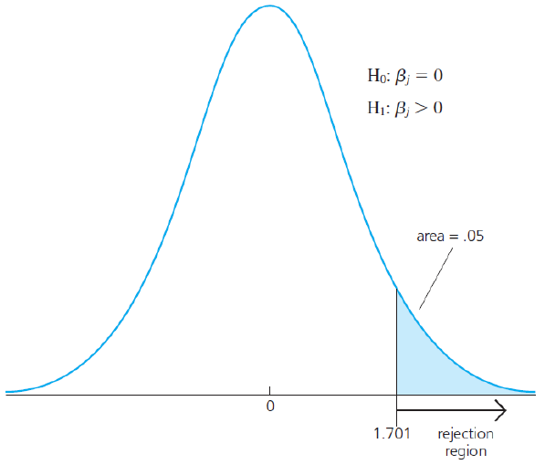
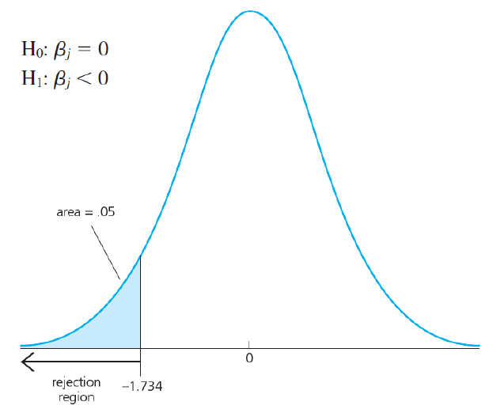
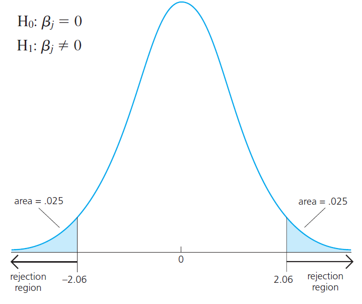
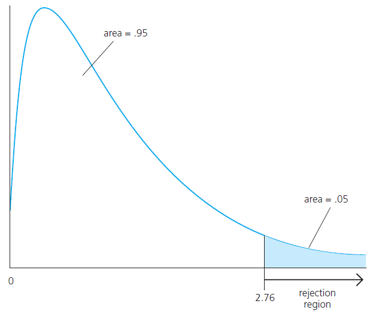

class: my-medium-font

<style type="text/css">
.remark-slide-content {
    font-size: 25px;
    padding: 1em 4em 1em 4em;
}
.my-large-font {
  font-size: 40px;
}
.my-small-font {
  font-size: 20px;
}
.my-medium-font {
  font-size: 30px;
}
.left-column {
  width: 75%;
  float: left;
  padding-top: 1em;
}
.right-column {
  width: 25%;
  float: right;
  padding-top: 1em;
}
</style>


# Plan

- [Çoklu regresyon modeli](#mlr) 

- [Kategorik değişkenler](#kukla) 

- [Etkileşim değişkenleri](#interaction) 

- [Hipotez testleri](#hipotez) 


---
name: mlr 

# Çoklu regresyon modeli 

- Basit regresyon modelinde sadece bir $x$ değişkeni vardır. Bu çoğu durumda gerçekçi değildir. $y$'yi etkileyen çok sayıda önemli faktör vardır. 

- Modele teorik açıdan önemli değişkenler ekleyerek $y$'deki değişkenliğin çok daha fazlasını açıklayabiliriz. 

- Ayrıca daha esnek fonksiyon kalıplarını kullanabiliriz. 

- En genel haliyle çoklu regresyon modeli aşağıdaki gibi yazılabilir. 
$$ y= \beta_0 + \beta_1 x_1 + \beta_2 x_2 + \ldots + \beta_k x_k + u$$
Modelde $k$ $x$ değişkeni ve bir sabit terim (kesme terimi) mevcuttur. Bilinmeyen parametres sayısı $k+1$'dir. 


---
# Çoklu regresyon modeli 

- $\beta_j$ parametresi diğer $x$'ler ve $u$'da içerilen faktörler sabitken ( $\Delta u=0$ ), $x_j$'deki bir birimlik değişmenin $y$'de yaratacağı değişmeyi gösterir.

- Ancak $x$'ler arasında doğrusal olmayan özellik varsa bu yorum değişir. Örneğin aşağıdaki modeli düşünelim:
$$\log(salary) = \beta_0 + \beta_1 \log(sales) + \beta_2 ceoten + \beta_3 ceoten^2 +u$$
$ceoten$: yöneticinin aynı işyerinde çalışma süresi (yıl), kıdemi (tenure)

- Burada $\beta_1$ maaşların satışlara göre esnekliğidir. Diğer her şey sabitken (ceteris paribus), satışlarda meydana gelen %1 artışın yönetici maaşlarında yaratacağı yüzde değişmedir. 

- Ancak $\beta_2$ kıdemde bir yıl artış olduğunda maaşlarda ortaya çıkan yüzde değişimi göstermez. Karesel terimi de dikkate almak zorundayız.

---
# Sıradan En Küçük Kareler (OLS) Tahmini

- Örneklem Regresyon Fonksiyonu (SRF): 
$$\hat{y} = \hat{\beta}_0 + \hat{\beta}_1 x_1 + \hat{\beta}_2 x_2 + \ldots + \hat{\beta}_k x_k$$

- Sıradan En Küçük Kareler (Ordinary Least Squares - OLS) tahmin edicileri kalıntı kareleri toplamını (SSR) en küçük yapar:
$$\sum_{i=1}^n \hat{u}_i^2 = \sum_{i=1}^n (y_i - \hat{\beta}_0 - \hat{\beta}_1 x_{i1} - \hat{\beta}_2 x_{i2} - \ldots - \hat{\beta}_k x_{ik})^2$$
- Birinci sıra koşullarından elde edilen $k+1$ denklemin çözümünden OLS tahmin edicileri $\hat{\beta}_j$'ler bulunur.

- R programındaki `lm()` fonksiyonu ile model kolayca tahmin edilebilir. 

---
# OLS Tahmini 

.pull-left[
```{r, echo=FALSE, out.width = "100%", fig.align='center'}
knitr::include_graphics("img/reg4.png")
``` 
]

.pull-right[
* İki kestirim değişkeninin $X_1,X_2$ olduğu durumda OLS tahmin doğrusu bir yüzeye dönüşür. 

* kırmızı noktalar: gözlem noktaları

* OLS bu noktaların yüzeye olan uzaklığının karesini en küçük yapar. 
]

---
# Örnek 
Çoklu regresyon: $sales = \beta_0 + \beta_1 TV + \beta_2 Radio + \beta_3 Newspaper + \epsilon$


|            | Estimate| Std. Error| t value| Pr(>&#124;t&#124;)|
|:-----------|--------:|----------:|-------:|------------------:|
|(Intercept) |    2.939|      0.312|   9.422|             0.0000|
|TV          |    0.046|      0.001|  32.809|             0.0000|
|radio       |    0.189|      0.009|  21.893|             0.0000|
|newspaper   |   -0.001|      0.006|  -0.177|             0.8599|

Basit regresyon: $sales = \alpha_0 + \alpha_1 Newspaper + \epsilon$

|            | Estimate| Std. Error| t value| Pr(>&#124;t&#124;)|
|:-----------|--------:|----------:|-------:|------------------:|
|(Intercept) |   12.351|      0.621|  19.876|             0.0000|
|newspaper   |    0.055|      0.017|   3.300|             0.0011|

---
# Katsayı tahminlerinin yorumu üzerine 

- Eğim parametre tahminleri, $\hat{\beta}_j$, açıklayıcı değişkenlerin $y$ üzerindeki kısmi ya da ceteris paribus etkilerini verir.

- $\hat{\beta}_1$'nın yorumu: $x_2$ sabitken, yani $\Delta x_2=0$
$$\Delta \hat{y}= \hat{\beta}_1 \Delta x_1$$
- Benzer şekilde $x_1$ sabitken $\hat{\beta}_2$'nın yorumu
$$\Delta \hat{y} = \hat{\beta}_2 \Delta x_2$$
- Önceki örnekte gazete reklamlarının (newspaper) çoklu modelde anlamsız hale geldiğine dikkat ediniz. 

---
# Örnek: Öğrencilerin başarısını belirleyen faktörler
- Model: 
$$\widehat{colGPA} = 1.29 + 0.453~ hsGPA + 0.0094~ ACT$$
$n=141$ öğrenci, $colGPA$: üniversite genel not ortalaması (4 üzerinden puan), $hsGPA$: lise not ortalaması, $ACT$: genel yetenek sınav sonucu

- Sabit terim $\hat{\beta}_0=1.29$ olarak tahmin edilmiş. $hsGPA=0$ ve $ACT=0$ olduğunda modelce tahmin edilen üniversite başarı notu. Ancak örneklemde lise not ortalaması ve ACT puanı 0 olan öğrenci olmadığından yorumlanması anlamsız.

- $ACT$'ı sabit tutarak lise $GPA$ notunu 1 puan artırdığımızda üniversite $GPA$'sı yarım puana yakın (0.453) artıyor. ACT notu aynı olan iki öğrenciden lise $GPA$'sı yüksek olanın üniversite $GPA$'sı da yüksek olacaktır.

- $ACT$'ın işareti $+$'dır ancak katsayısı çok küçük olduğu için etkisi fazla değil.

---
# Örnek (devam)

- Sadece $ACT$ notunu alarak basit regresyon tahmin etseydik şöyle olacaktı:
$$\widehat{colGPA} = 2.4 + 0.0271~ ACT$$

- $ACT$'ın katsayısı önceki çoklu regresyonda bulunandan 3 kat daha yüksek çıktı.

- Ancak, bu regresyon, bize, lise $GPA$'sı aynı iki öğrenciyi karşılaştırma olanağı vermiyor. Çoklu regresyon veriyordu.

- Lise not ortalamasını kontrol ettiğimizde $ACT$ puanının önemi azalıyor.

---
# Örnek: Logaritmik Ücret Denklemi

-  $n=526$ gözlemden hareketle tahmin Sonuçları
$$\widehat{log~Ucret} = 0.284 + 0.092~ egitim + 0.0041~ tecrube+ 0.022~ kidem$$
- Katsayı tahminleri *ceteris paribus* yorumlanmalı.

- Bağımlı değişken logaritmik, açıklayıcı değişkenler kendi ölçü birimleriyle modelde yer aldığından (log-level) katsayı tahminleri 100 ile çarpılarak % olarak yorumlanmalı.

- Örneğin, tecrübe ve kıdem sabit tutulduğunda eğitim bir yıl arttırıldığında ücretler ortalama % 9.2 artmaktadır.

- Başka bir ifadeyle, tecrübe ve kıdem düzeyleri aynı olan iki çalışandan birinin eğitim düzeyi diğerinden bir yıl fazlaysa, bu iki çalışan için tahmin edilen ücret farkı ortalama % 9.2'dir.

- Burada somut iki işçiden değil ortalama durumdan bahsedilmektedir.

     
---
name: kukla 

# Kategorik X değişkenleri 

* Regresyon modellerinde niteliksel bilgiyi içeren kategorik değişkenleri ekleyebiliriz. 

* İki kategori, cinsiyet = Kadın, Erkek
$$x_{i}=\left\{\begin{array}{ll}
1, & \text { eğer } i . \text { kişi kadın ise } \\
0, & \text { eğer } i . \text { kişi erkek ise. }
\end{array}\right.$$

$$y_{i}=\beta_{0}+\beta_{1} x_{i}+\epsilon_{i}=\left\{\begin{array}{ll}
\beta_{0}+\beta_{1}+\epsilon_{i}, & \text { eğer } i . \text { kişi kadın ise } \\
\beta_{0}+\epsilon_{i}, & \text { eğer } i . \text { kişi erkek ise. }
\end{array}\right.$$


* $\beta_0$: erkek grubu için regresyon kesme noktası (sabit)
* $\beta_{0}+\beta_{1}$: kadın grubu için kesme noktası
* İki kategori için bir kukla değişken eklemek yeterli. 
* İkiden fazla kategorisi olan değişkenler için bir eksiği kadar kukla değişken modele eklenebilir. Örneğin etnik köken değişkeni 3 gruba sahipse, modele 2 kategoriyi temsil eden kukla değişkenin eklenmesi yeterlidir. Dışlanan grup kesme terimi ile temsil edilir (baz grup).


---
# Cinsiyete göre ortalama ücretler 
.pull-left[
```{r, echo=FALSE, out.width = "100%", fig.align='center'}
knitr::include_graphics("img/ucret_cins1.png")
``` 
]

.pull-right[
* Ücretlerin cinsiyet (female = 1 kadın ise, female = 0 erkek ise) kuklası üzerine regresyonu

$$\widehat{wage} = 7.1 - 2.51 female$$
Baz grup (0 grubu) erkek çalışanlardır. Buna göre erkek çalışanların sabit terimi 7.1'dir. Kadın çalışanların (female=1) sabit terimi erkeklerden 2.51 USD daha düşüktür (4.5$)

* Modelde başka bir x değişkeni olmadığı için 7.1 erkek grubundaki aritmetik ortalamadır. Kadın grubundaki aritmetik ortalama ise 4.5$'dır. 
]

---
# Eğitim ve ücretler + cinsiyet kuklası
.pull-left[
```{r, echo=FALSE, out.width = "100%", fig.align='center'}
knitr::include_graphics("img/ucret_cins2.png")
``` 
]

.pull-right[
* Tahmin sonuçları 

$$\widehat{\log wage} = 0.83  - 0.36 female + 0.077educ$$
Baz grup (0 grubu) erkek çalışanlardır. Buna göre erkek çalışanların sabit terimi 0.83'dir. Kadın çalışanların (female=1) sabit terimi erkeklerden 0.36 daha düşüktür (0.47). 

* Educ değişkeninin katsayısı 0.077 her iki grup için de aynıdır. Yani bir yıllık fazladan eğitimin getirisi hem kadınlar için hem de erkekler için % 7.7'dir. 

]


* Eğitim düzeyi aynı olan bir erkek ve kadını karşılaştırdığımızda kadınlar hala daha az kazanıyor. 


---
name: interaction

# Etkileşim

* Bazı durumlarda bir değişkenin marjinal etkisi başka bir değişkene bağlı olabilir. 

* Örneğin satış ve reklam harcamaları modelinde radyo ilan harcamaları TV reklamlarının etkisi arttırabilir. 
$$sales = \beta_{0}+\beta_{1}~ TV+\beta_{2}~ Radio + \beta_3~ (TV\times Radio) + \epsilon$$
ya da 
$$sales = \beta_{0}+(\beta_{1}+\beta_3 Radio)~ TV+\beta_{2}~ Radio  + \epsilon$$
Böylece 
$$\frac{\Delta Sales}{\Delta TV}=\beta_{1}+\beta_3 Radio,\quad \frac{\Delta Sales}{\Delta Radio}=\beta_{2}+\beta_3 TV$$


---
# Etkileşim: Örnek 

|              | Estimate| Std. Error| t value| Pr(>&#124;t&#124;)|
|:-------------|--------:|----------:|-------:|------------------:|
|(Intercept)   |   6.7502|     0.2479| 27.2328|             0.0000|
|TV            |   0.0191|     0.0015| 12.6990|             0.0000|
|radio         |   0.0289|     0.0089|  3.2408|             0.0014|
|I(TV * radio) |   0.0011|     0.0001| 20.7266|             0.0000|

* TV, radio: USD cinsinden televizyon ve radyo reklam harcamaları,
* Radyo reklamlarındaki 1000 dolarlık bir artış için satışlarda ortalamada ne kadar değişim tahmin edilmiştir? 
* $\Delta Sales = (0.0289+0.0011TV)\times 1000 = 28.9 + 1.1TV$
* Ortalama TV harcamaları 147. Bunu TV yerine yazarsak ortalamadaki etkiyi 190.6 USD olarak buluruz. 

---
# Doğrusal Olmayan İlişkiler

* Modelin parametrlerde doğrusal olan yapısını bozmadan $y$ ve $x$ değişkenlerinin uygun dönüştürmelerini kullanarak doğrusal olmayan ilişkileri yakalayabiliriz. 

* Pratikte en çok kullanılan dönüştürmeler (doğal) logaritma ve üstel dönüştürmelerdir. Bu modellerin özelliklerini daha önce incelemiştik. 

* Polinom regresyonu: $X$ değişkeninin $X^2$ ve $X^3$ gibi dönüştürmelerini modele ekleyebiliriz. Örneğin karesel model: 
$$Y = \beta_0 + \beta_1 X + \beta_2 X^2 + \epsilon$$
Bu model aslında $X$ değişkeninin kendisiyle etkileşim içinde olduğu anlamına gelir. $X$'in $Y$ üzerindeki etkisi $X$'in değerine bağlıdır. 

* Adım fonksiyonu: $X$'in değerler aralığı parçalara bölünerek kategorik değişkenler oluşturulur.


---
name: hipotez

# Hipotez testleri

- Hata teriminin normal dağıldığı varsayımı altında OLS tahmincileri de normal dağılıma uyar. 

- Buradan hareketle tekil parametreler için ya da bu parametrelerin doğrusal kombinasyonları için hipotezler sınanabilir. 

- Tek parametre için t testi ile sınayabileceğimizi görmüştük. Örneğin 
$$H_0:~\beta_1=0$$
- Alternatif hipotez tek yanlı (sağ ya da sol kuyruk) ya da çift yanlı olabilir. 

- Verilmiş bir anlamlılık düzeyi için t istatistiği ile kritik değer karşılaştırılır. 

---
# t testi: sağ kuyruk 
.left-column[
```{r, echo=FALSE, out.width = "75%", fig.align='left'}

``` 
]
.right-column[ 
$$H_0:\beta_j = 0$$
$$H_1:\beta_j > 0$$
Grafikte t kritik değeri $c=1.701$'dir. Bu değerden büyük t istatistikleri için boş hipotez reddedilir. 
]

---
# t testi: sol kuyruk 
.left-column[
```{r, echo=FALSE, out.width = "75%", fig.align='left'}

``` 
]
.right-column[ 
$$H_0:\beta_j = 0$$
$$H_1:\beta_j < 0$$
Grafikte t kritik değeri $c=-1.734$'dür. Bu değerden küçük t istatistikleri için boş hipotez reddedilir. 
]

---
# t testi: çift taraflı 
.left-column[
```{r, echo=FALSE, out.width = "75%", fig.align='left'}

``` 
]
.right-column[ 
$$H_0:\beta_j = 0$$
$$H_1:\beta_j \neq 0$$
Grafikte t kritik değeri $c=2.06$'dür. Eğer t istatistiğinin mutlak değeri bu değerden büyükse boş hipotez reddedilir. 
]


---
# Güven Aralıkları

- Klasik regresyon modeli varsayımları altında popülasyon parametreleri için güven aralıkları oluşturulabilir.

- Aşağıdaki oranın $n-k-1$ serbestlik derecesi ile $t$ dağılımına uyduğunu biliyoruz:
$$t_{\hat{\beta}_j} = \frac{\hat{\beta}_j }{se(\hat{\beta}_j)} \sim~ t_{n-k-1}$$

- Bu oranı kullanarak $\%100(1-\alpha)$ güven aralığı şu şekilde oluşturulabilir:
$$\hat{\beta}_j \pm c\cdot \mbox{se}(\hat{\beta}_j)$$

- Alt ve üst güven sınırları, sırasıyla:
$$\underline{\beta_j}\equiv \hat{\beta}_j - c\cdot \mbox{se}(\hat{\beta}_j),~~~\overline{\beta_j}\equiv \hat{\beta}_j + c\cdot \mbox{se}(\hat{\beta}_j)$$


---
# Güven Aralığının Yorumu

$$[\hat{\beta}_j - c\cdot \mbox{se}(\hat{\beta}_j),~ \hat{\beta}_j + c\cdot \mbox{se}(\hat{\beta}_j)]$$

- İstatistik dersinde öğrendiğimiz güven aralığı yorumunu burada da yapacağız.

- Olanaklı tüm örneklemleri çeksek ve her örneklem için regresyon tahmin edip, ilgili populasyon katsayısı için güven aralıkları oluştursak, bu güven aralıklarının $\%100(1-\alpha)$ kadarı doğru parametre değerini içerecektir.

- Örneğin 100 güven aralığından 95'inin doğru parametreyi içerdiğini söyleriz. Burada $\alpha/2=0.025$ olduğuna dikkat ediniz.

- Pratikte elimizde sadece bir güven aralığı vardır ve biz doğru değerin bu aralık içinde olup olmadığını bilmeyiz. 


---
# Güven Aralığının Yorumu

- Güven aralıklarını hesaplayabilmek için üç büyüklüğe ihtiyaç vardır: katsayı tahmini, katsayı tahmininin standart hatası ve kritik değer.

- Örneğin sd=25 ve \%95 güven düzeyi ile herhangi bir anakütle parametresi için güven aralığı
$$[\hat{\beta}_j - 2.06\cdot \mbox{se}(\hat{\beta}_j),~ \hat{\beta}_j + 2.06\cdot \mbox{se}(\hat{\beta}_j)]$$

- $n-k-1>50$ ise %95 güven aralığı kısa yoldan $\hat{\beta}_j \pm 2\cdot \mbox{se}(\hat{\beta}_j)$ formülü ile bulunabilir.

- Aşağıdaki hipotezi test etmek istediğimizi düşünelim:
$$H_0:\beta_j = a_j$$
$$H_1:\beta_j \neq a_j$$
- $H_0$ ancak ve ancak %95 güven aralığı $a_j$'yi içermiyorsa %5 anlamlılık düzeyinde $H_1$ lehine reddedilebilir.


---
#  F Testi: Çoklu Doğrusal Kısıtların Testi

- Regresyondaki $t$ istatistikleri anakütleye ait beta parametrelerinin belli bir sabite eşit olup olmadığını test etmemize yarar.

- Parametrelerin tek bir doğrusal kombinasyonunun (kısıtın) belli bir sabite eşit olup olmadığının testini ise, önceki örnekte gördüğümüz gibi, değişkenleri dönüştürerek modeli yeniden düzenlemek suretiyle yapıyorduk.

- Ancak, şu ana kadar hep tek bir kısıtlamaya ilişkin test yapıyorduk.

- Şimdi çok sayıda kısıt varken nasıl test yapacağımızı görelim. 

---
# Dışlama kısıtları 

- Regresyonda yer alan bir değişkenler grubunun birlikte $y$ üzerinde anlamlı bir etkisinin olup olmadığını test etmek istiyoruz.

- Örneğin şu modelde
$$y = \beta_0 + \beta_1 x_1 + \beta_2 x_2 +\beta_3 x_3 +\beta_4 x_4 +\beta_5 x_5 + u$$
şu hipotezi test etmek istiyoruz:
$$H_0: \beta_3 =0, \beta_4=0, \beta_5=0$$
$$H_1: \beta_3 \neq 0, \beta_4\neq 0, \beta_5\neq 0$$
- Boş hipotez, $x_3$, $x_4$ ve $x_5$ değişkenlerinin birlikte $y$ üzerinde bir etkisinin olmadığını söylemektedir. Alternatif hipotez en az birinin sıfırdan farklı olduğunu söylemektedir.


---
# Dışlama kısıtları 

- Kısıtlanmamış (UnRestricted) Model
$$y = \beta_0 + \beta_1 x_1 + \beta_2 x_2 +\beta_3 x_3 +\beta_4 x_4 +\beta_5 x_5 + u$$
$SSR_{ur},~~~R^2_{ur}$

- Kısıtlanmış (Restricted) Model
$$y = \beta_0 + \beta_1 x_1 + \beta_2 x_2 + u$$
$SSR_{r},~~~R^2_{r}$

- $H_0$ doğru kabul edildiğinde kısıtlanmış modele ulaşılır.

- Her iki model ayrı ayrı tahmin edilerek kalıntı kareleri toplamlarındaki değişim $F$ testi yardımıyla karşılaştırılabilir. 

---
# F testi

- F test istatistiği
$$F = \frac{(SSR_r - SSR_{ur})/q}{SSR_{ur}/(n-k-1)}\sim~~F_{q,n-k-1}$$

- $SSR_r$ kısıtlanmış modelin, $SSR_{ur}$ ise kısıtlanmamış modelin Kalıntı Kareleri Toplamıdır.

- $q=df_r-df_{ur}$: toplam kısıt sayısı, payın serbestlik derecesi (kısıtlanmamış modelin parametre sayısından kısıtlanmış modelin parametre sayısı çıkarılarak bulunabilir)

- Paydanın serbestlik derecesi ( $df_{ur}$ ) kısıtlanmamış modelin serbestlik derecesine eşittir.

- Karar kuralı: $F>c$ ise $H_0$ RED. $c$, ilgili $F_{k,n-k-1}$ dağılımında %100$\alpha$ düzeyindeki kritik değerdir.

---
# F testi için karar kuralı 
.pull-left[
```{r, echo=FALSE, out.width = "100%", fig.align='left'}

``` 
]
.pull-right[
- F testi her zaman sağ kuyrukta yapılır. 

- Hesaplanan F değeri verilmiş bir anlamlılık düzeyindeki (alfa) kritik değerden daha büyükse H0 reddedilir.

- Ya da F testinin p-değeri yeterince küçükse (örneğin alfa = 0.05'den küçükse) boş hipotez reddedilir. 
]

---
# Doğrusal kısıtlar: örnek

- Aşağıdaki ev değeri modelini düşünelim: 
$$\log(fiyat) = \beta_0+\beta_1 \log(ekspertiz)+\beta_2 odasay+\beta_3metrekare+\beta_4okul + u$$
Burada fiyat evin satış değerini, ekspertiz gayrimenkul uzmanlarınca yapılan değerlemeyi, odasay evdeki toplam oda sayısını, metrekare evin büyüklüğünü, okul ise civardaki okulların kalitesini göstermektedir. 

- İyi işleyen bir gayrimenkul piyasasında ekspertiz ile evin değeri arasında bire bir bir ilişki bekleriz (evin özelliklerini dikkate aldıktan sonra)

- Ev değerlemesi rasyonel yapıldıysa (piyasada balon yoksa) log(ekspertiz) katsayısı 1, diğer tüm katsayılar 0 olmalı: 
$$H_0: \beta_1 = 1,~ \beta_2=0,~ \beta_3 =0,~ \beta_4 = 0$$

---
# Rasyonel ev değerlemesi örneği 

- Kısıtlanmamış model: 
$$\log(fiyat) = \beta_0+\beta_1 \log(ekspertiz)+\beta_2 odasay+\beta_3metrekare+\beta_4okul + u$$

- Kısıtlanmış model: 
$$H_0: \beta_1 = 1,~ \beta_2=0,~ \beta_3 =0,~ \beta_4 = 0$$
altında kısıtlanmış model: 
$$\log(fiyat) = \beta_0+\log(ekspertiz) + u$$
ya da 
$$\log(fiyat) - \log(ekspertiz) = \beta_0 + u$$


---
# Regresyonun Bütün Olarak Anlamlılığı

- Boş hipotezimiz şudur: regresyona eklenen açıklayıcı değişkenlerin $y$ üzerinde birlikte etkisi yoktur:
$$H_0:\beta_1=\beta_2=\ldots=\beta_k=0$$

- Alternatif hipotez: en az biri sıfırdan farklı olduğunu söyler. Boş hipoteze göre kurulan modelin bir açıklayıcılığı yoktur. Bu boş hipotez altında
$$y = \beta_0 +u$$

- Bu boş hipotez $F$ testiyle sınanabilir. $F$ test istatistiği
$$F = \frac{R^2/k}{(1-R^2)/(n-k-1)}\sim~F_{k,n-k-1}$$

- Buradaki $R^2$ kısıtlanmamış modelden elde edilen determinasyon katsayısıdır. Standart ekonometri paket programları regresyonun bütün olarak anlamlılığını sınayan F istatistiğini otomatik olarak hesaplar.
    
    

    
    
    
    
