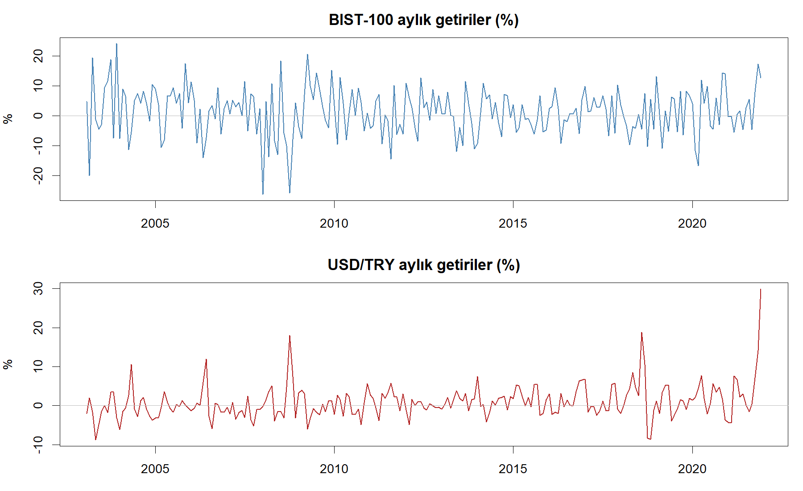
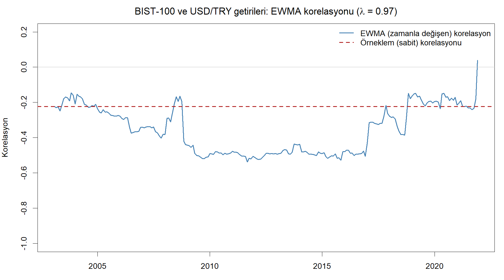

class: my-medium-font

<style type="text/css">
.remark-slide-content {
    font-size: 25px;
    padding: 1em 4em 1em 4em;
}
.my-large-font {
  font-size: 40px;
}
.my-small-font {
  font-size: 20px;
}
.my-medium-font {
  font-size: 30px;
}
.left-column {
  width: 75%;
  float: left;
  padding-top: 1em;
}
.right-column {
  width: 25%;
  float: right;
  padding-top: 1em;
}
</style>


# Plan

.pull-left[
- [Kovaryans modellemesi: Motivasyon](#motivasyon)

- [Basit kovaryans modelleri](#basit)

- [EWMA kovaryans modelleri](#ewma)

- [MGARCH: VECH ve Diagonal VECH](#vech)

- [BEKK modeli ve tahmin](#bekk)

- [Korelasyon modelleri: CCC](#ccc)
]

.pull-right[
- [Dinamik Koşullu Korelasyon (DCC)](#dcc)

- [Asimetrik çok değişkenli GARCH](#asimetrik)

- [Uygulama: Riske Maruz Değer (VaR)](#var)

- [Uygulama: Koşullu CAPM betası](#capm)

- [Uygulama: Dinamik hedge oranı](#hedge)

- [R'da çok değişkenli GARCH](#rmgarch)
]


---
name: motivasyon

# Kovaryans modellemesi: Motivasyon

- Önceki derste incelediğimiz tek değişkenli volatilite modellerinin (ARCH, GARCH ve uzantıları) önemli bir kısıtı vardır: her serinin koşullu varyansı diğer serilerden tamamen bağımsız olarak modellenir.

- Bu kısıt iki nedenle önemlidir:
  - Piyasalar ya da varlıklar arasında **oynaklık yayılması** (volatility spillover) varsa tek değişkenli model yanlış tanımlanmış (mis-specified) olur.
  - Uygulamada çoğu zaman serilerin **arasındaki kovaryanslar** da ilgi konusudur.

- Riskten korunma (hedge) oranlarının, portföy riske maruz değer (VaR) tahminlerinin, CAPM betalarının vb. hesaplanması girdi olarak kovaryansları gerektirir.

---
# Kovaryans modellemesi: Motivasyon

- Varyansların yanı sıra kovaryansları da modelleyen çok değişkenli GARCH (Multivariate GARCH, MGARCH) modelleri şunların tahmininde kullanılabilir:

  - Koşullu (zamana göre değişen) CAPM betaları

  - Dinamik riskten korunma (hedge) oranları

  - Portföy varyansları

- Tek değişkenli durumda olduğu gibi, çok değişkenli modellere geçmeden önce basit kovaryans ölçütlerini gözden geçirelim: tarihsel kovaryans, ima edilen kovaryans ve EWMA kovaryansı.

---
name: basit

# Basit kovaryans modelleri: Tarihsel kovaryans

- **Tarihsel kovaryans/korelasyon**: volatilitede olduğu gibi, iki seri arasındaki kovaryans veya korelasyon belli bir döneme ait tarihsel verilerden hareketle hesaplanabilir:
$$\widehat{Cov}(x,y)=\frac{1}{T-1}\sum_{t=1}^{T}(x_t-\bar{x})(y_t-\bar{y})$$

- Örneklem korelasyonu kovaryansın standart sapmaların çarpımına bölünmesiyle elde edilir:
$$\hat{\rho}_{xy}=\frac{\widehat{Cov}(x,y)}{s_x s_y}$$

- Bu yaklaşım kovaryansın/korelasyonun örneklem dönemi boyunca **sabit** olduğunu varsayar.

---
# İma edilen (implied) kovaryans

- Getirisi birden fazla dayanak varlığa bağlı olan opsiyonların fiyatlarından hareketle **ima edilen kovaryanslar** hesaplanabilir.

- Örneğin döviz opsiyonları için çapraz kur getirisinin ima edilen varyansı şöyle yazılabilir:
$$\tilde{\sigma}^2(xy) = \tilde{\sigma}^2(x) + \tilde{\sigma}^2(y) - 2\tilde{\sigma}(x,y)$$
Burada $\tilde{\sigma}^2(x)$ ve $\tilde{\sigma}^2(y)$ sırasıyla $x$ ve $y$ getirilerinin ima edilen varyansları, $\tilde{\sigma}(x,y)$ ise $x$ ile $y$ arasındaki ima edilen kovaryanstır.

- Örneğin USD/EUR ile USD/JPY arasındaki ima edilen kovaryans ile ilgileniyorsak, USD/EUR ve USD/JPY getirilerinin ve çapraz kur EUR/JPY getirisinin ima edilen varyansları gereklidir.

- Bu tür opsiyonların sayısının görece az olması ima edilen kovaryansların hesaplanabileceği durumları sınırlamaktadır.

---
name: ewma

# EWMA kovaryans modelleri

- Üstel ağırlıklı hareketli ortalama (EWMA) yaklaşımı, basit ortalamaya dayanan tarihsel tahminden farklı olarak yakın geçmişteki gözlemlere daha fazla ağırlık verir.

- İki getiri serisi, $x$ ve $y$, için EWMA varyans ve kovaryans tahminleri şöyle yazılabilir:
$$h_{ij,t}=\lambda h_{ij,t-1}+(1-\lambda)x_{t-1}y_{t-1}$$
Kovaryans için $i\neq j$; varyans için $i=j$ ve $x=y$ olur.

- $h$ değerleri aynı zamanda izleyen dönemler için öngörü değerleridir.

- $\lambda$ $(0<\lambda<1)$ **sönüm (decay) parametresidir**: yakın ve uzak gözlemlere verilen göreli ağırlıkları belirler. Tahmin edilebilir; ancak uygulamada genellikle önceden belirlenmiş bir değer kullanılır (örneğin RiskMetrics günlük verilerde 0.94, aylık verilerde 0.97 kullanmaktadır).

---
# EWMA kovaryans modelleri: Kısıtlar

- Kovaryansları ardışık olarak yerine koyarsak EWMA denklemi yalnızca getirilerin sonsuz dereceden bir fonksiyonu olarak yazılabilir:
$$h_{ij,t}=(1-\lambda)\sum_{i=0}^{\infty}\lambda^i x_{t-i}y_{t-i}$$

- EWMA modeli bütünleşik GARCH (IGARCH) modelinin kısıtlanmış bir versiyonudur ve tahmin edilen varyans-kovaryans matrisinin **pozitif tanımlı** olmasını garanti etmez.

- Ayrıca EWMA modelleri, özellikle düşük frekanslı verilerde belirgin olan, varlık getirilerinin volatilite ve kovaryanslarındaki **ortalamaya dönüş** (mean reversion) özelliğini yakalayamaz.

---
# Örnek: BIST-100 ve USD/TRY getirileri

```{r, echo=FALSE, out.width = "75%", fig.align='center'}

```

.my-small-font[Veri: BIST-100 endeksi ve USD/TRY kuru, aylık, 2003:01-2021:12. Getiriler logaritmik fark olarak hesaplanmıştır.]

---
# Örnek: EWMA korelasyonu

```{r, echo=FALSE, out.width = "75%", fig.align='center'}

```

- Korelasyon zaman içinde sabit değildir; küresel finansal kriz sonrasında belirgin biçimde güçlenmiştir (mutlak değerce). Sabit korelasyon varsayımı yanıltıcı olabilir.

---
name: vech

# Çok değişkenli GARCH modelleri

- Çok değişkenli GARCH (MGARCH) modelleri kovaryansların ve korelasyonların tahmininde ve öngörüsünde kullanılır.

- Temel kurgu tek değişkenli GARCH modeline benzer; ancak varyansların yanı sıra **kovaryansların da zamana bağlı olarak değişmesine** izin verilir.

- Yaygın olarak kullanılan üç temel MGARCH formülasyonu vardır: **VECH**, **diagonal VECH** ve **BEKK**.

- İki değişkenli durumda koşullu kovaryans matrisi $H_t$ $(2\times 2)$ ve VECH operatörü şöyle yazılabilir:
$$H_t=\left[\begin{array}{ll} h_{11t} & h_{12t} \\ h_{21t} & h_{22t} \end{array}\right],\qquad VECH(H_t)=\left[\begin{array}{l} h_{11t} \\ h_{22t} \\ h_{12t} \end{array}\right]$$

---
# VECH modeli

- VECH modelinde her bir koşullu varyans ve kovaryans; tüm varyans ve kovaryansların gecikmeli değerlerine, hata terimlerinin karelerinin ve çapraz çarpımlarının gecikmelerine bağlıdır.

- Matris formunda:
$$VECH(H_t)=C+A\, VECH(\Xi_{t-1}\Xi_{t-1}')+B\, VECH(H_{t-1})$$
$$\Xi_t|\psi_{t-1}\sim N(0,H_t)$$
Burada $\Xi_t=(u_{1t},u_{2t})'$ hata vektörü, $\psi_{t-1}$ ise $t-1$ dönemine kadarki bilgi kümesidir.

- İki değişkenli durumda bile $C$ $(3\times 1)$, $A$ ve $B$ $(3\times 3)$ olmak üzere toplam **21 parametre** tahmin edilmelidir. Değişken sayısı arttıkça parametre sayısı hızla artar.

---
# VECH modeli: Matris işlemleri

- Modeldeki terimleri adım adım açalım. Hata vektörünün kendi devriğiyle (dış) çarpımı $2\times 2$ bir matristir:
$$\Xi_{t-1}\Xi_{t-1}'=\begin{bmatrix}u_{1t-1}\\ u_{2t-1}\end{bmatrix}\begin{bmatrix}u_{1t-1} & u_{2t-1}\end{bmatrix}=\begin{bmatrix}u_{1t-1}^2 & u_{1t-1}u_{2t-1}\\ u_{2t-1}u_{1t-1} & u_{2t-1}^2\end{bmatrix}$$

- Matris simetrik olduğu için VECH operatörü yalnızca köşegeni ve köşegen altını alır (sıralama: iki varyans terimi, sonra kovaryans terimi):
$$VECH(\Xi_{t-1}\Xi_{t-1}')=\begin{bmatrix}u_{1t-1}^2\\ u_{2t-1}^2\\ u_{1t-1}u_{2t-1}\end{bmatrix},\qquad VECH(H_{t-1})=\begin{bmatrix}h_{11t-1}\\ h_{22t-1}\\ h_{12t-1}\end{bmatrix}$$

- Yani hata karelerinin ve çapraz çarpımının gecikmeleri (ARCH kısmı) ile varyans-kovaryansların gecikmeleri (GARCH kısmı) modelin açıklayıcılarıdır.

---
# VECH modeli: Matris işlemleri

- Tüm matrisleri açık biçimde yazarsak iki değişkenli VECH sistemi şöyle görünür:

$$\underbrace{\begin{bmatrix}h_{11t}\\ h_{22t}\\ h_{12t}\end{bmatrix}}_{VECH(H_t)}=\underbrace{\begin{bmatrix}c_{11}\\ c_{21}\\ c_{31}\end{bmatrix}}_{C}+\underbrace{\begin{bmatrix}a_{11}&a_{12}&a_{13}\\ a_{21}&a_{22}&a_{23}\\ a_{31}&a_{32}&a_{33}\end{bmatrix}}_{A}\underbrace{\begin{bmatrix}u_{1t-1}^2\\ u_{2t-1}^2\\ u_{1t-1}u_{2t-1}\end{bmatrix}}_{VECH(\Xi_{t-1}\Xi_{t-1}')}+\underbrace{\begin{bmatrix}b_{11}&b_{12}&b_{13}\\ b_{21}&b_{22}&b_{23}\\ b_{31}&b_{32}&b_{33}\end{bmatrix}}_{B}\underbrace{\begin{bmatrix}h_{11t-1}\\ h_{22t-1}\\ h_{12t-1}\end{bmatrix}}_{VECH(H_{t-1})}$$

- Parametre sayısı buradan kolayca görülür: $C$ vektöründe 3, $A$ ve $B$ matrislerinde 9'ar olmak üzere toplam $3+9+9=21$.

- Matris çarpımını satır satır yaparsak üç denklem elde ederiz (izleyen slayt).

---
# VECH modeli: Açık yazım

- Örneğin birinci satır: $h_{11t}$ denklemi, $A$ matrisinin birinci satırı ile $VECH(\Xi_{t-1}\Xi_{t-1}')$ vektörünün ve $B$ matrisinin birinci satırı ile $VECH(H_{t-1})$ vektörünün çarpımından oluşur. Üç denklemin tamamı:

$$\begin{aligned}
h_{11t} &= c_{11}+a_{11}u_{1t-1}^2+a_{12}u_{2t-1}^2+a_{13}u_{1t-1}u_{2t-1}+b_{11}h_{11t-1}+b_{12}h_{22t-1}+b_{13}h_{12t-1}\\
h_{22t} &= c_{21}+a_{21}u_{1t-1}^2+a_{22}u_{2t-1}^2+a_{23}u_{1t-1}u_{2t-1}+b_{21}h_{11t-1}+b_{22}h_{22t-1}+b_{23}h_{12t-1}\\
h_{12t} &= c_{31}+a_{31}u_{1t-1}^2+a_{32}u_{2t-1}^2+a_{33}u_{1t-1}u_{2t-1}+b_{31}h_{11t-1}+b_{32}h_{22t-1}+b_{33}h_{12t-1}
\end{aligned}$$

- Görüldüğü gibi böyle bir modelin tahmini oldukça zordur.

---
# Diagonal VECH modeli

- $A$ ve $B$ matrislerinin köşegen olduğu varsayılırsa çok daha basit olan **diagonal VECH** modeli elde edilir. İki değişkenli durumda:

$$\begin{aligned}
h_{11t} &= \alpha_0+\alpha_1 u_{1t-1}^2+\alpha_2 h_{11t-1}\\
h_{22t} &= \beta_0+\beta_1 u_{2t-1}^2+\beta_2 h_{22t-1}\\
h_{12t} &= \gamma_0+\gamma_1 u_{1t-1}u_{2t-1}+\gamma_2 h_{12t-1}
\end{aligned}$$

- Her varyans/kovaryans yalnızca kendi gecikmesine ve ilgili hata karesine (ya da çapraz çarpımına) bağlıdır. Parametre sayısı 21'den 9'a düşer.

- Ancak bu model varyans-kovaryans yayılma etkilerini (spillover) dışlar.

- Ne VECH ne de diagonal VECH modeli $H_t$ matrisinin **pozitif tanımlı** olmasını garanti eder.

---
name: bekk

# BEKK modeli

- Engle ve Kroner (1995) tarafından önerilen **BEKK modeli**, parametre matrislerinde karesel (quadratic) form kullanarak varyans-kovaryans matrisinin pozitif tanımlı olmasını garanti eder.

- Matris formunda BEKK modeli:
$$H_t=W'W+A'H_{t-1}A+B'\Xi_{t-1}\Xi_{t-1}'B$$

- $W'W$ karesel formu her zaman pozitif yarı-tanımlıdır; benzer şekilde $A'H_{t-1}A$ ve $B'\Xi_{t-1}\Xi_{t-1}'B$ terimleri de pozitif tanımlılığı korur.

- Böylece parametreler üzerine ek kısıt koymaya gerek kalmadan $H_t$ pozitif tanımlı olur.

---
# MGARCH modellerinin tahmini

- Tüm MGARCH model sınıflarının tahmini, koşullu normallik varsayımı altında **en yüksek olabilirlik** (maximum likelihood) yöntemiyle yapılır. Log-olabilirlik fonksiyonu:

$$\ell(\theta)=-\frac{TN}{2}\log 2\pi-\frac{1}{2}\sum_{t=1}^{T}\left(\log|H_t|+\Xi_t'H_t^{-1}\Xi_t\right)$$

- Burada $N$ sistemdeki değişken sayısı, $\theta$ tüm parametreleri içeren vektör, $T$ ise gözlem sayısıdır.

- Çözüm nümerik optimizasyon yöntemleriyle bulunur. Değişken sayısı arttıkça parametre sayısı ve hesaplama yükü hızla artar (boyut laneti).

---
name: ccc

# Korelasyon modelleri ve CCC

- VECH ya da BEKK modelinden elde edilen koşullu kovaryansları koşullu standart sapmaların çarpımına bölerek her dönem için korelasyonlar hesaplanabilir.

- Alternatif bir yaklaşım korelasyon dinamiklerini **doğrudan modellemektir**.

- **Sabit koşullu korelasyon** (Constant Conditional Correlation, CCC) modelinde (Bollerslev, 1990) hata terimleri arasındaki korelasyonların zaman içinde sabit olduğu varsayılır.

- Koşullu kovaryanslar sabit değildir; ancak varyanslara bağlıdır.

- CCC modelinde koşullu varyanslar tek değişkenli GARCH spesifikasyonlarıyla aynıdır (birlikte tahmin edilseler de):
$$h_{ii,t}=c_i+a_i \epsilon_{i,t-1}^2+b_i h_{ii,t-1},\qquad i=1,\ldots,N$$

---
# CCC modeli (devam)

- $H_t$ matrisinin köşegen dışı öğeleri, $h_{ij,t}$ $(i\neq j)$, sabit korelasyonlar $\rho_{ij}$ aracılığıyla dolaylı olarak tanımlanır:
$$h_{ij,t}=\rho_{ij}\, h_{ii,t}^{1/2}\, h_{jj,t}^{1/2},\qquad i,j=1,\ldots,N,\quad i<j$$

- Korelasyonların zaman içinde sabit olduğu varsayımı ampirik olarak makul müdür?

- Bu varsayımı sınamak için bilgi matrisine dayalı test ve Lagrange Çarpanı (LM) testi gibi çeşitli testler geliştirilmiştir.

- Özellikle hisse senedi getirileri bağlamında sabit korelasyon varsayımına **aykırı** güçlü bulgular vardır (önceki BIST-100/USD örneğini hatırlayınız).

---
name: dcc

# Dinamik Koşullu Korelasyon (DCC) modeli

- Dinamik koşullu korelasyon (DCC) modelinin farklı formülasyonları vardır; en yaygın kullanılan spesifikasyon Engle (2002) tarafından önerilmiştir.

- Model CCC formülasyonuna benzer; ancak korelasyonların **zamana bağlı olarak değişmesine** izin verilir.

- Varyans-kovaryans matrisi şöyle ayrıştırılır:
$$H_t=D_t R_t D_t$$

- $D_t$: köşegeninde koşullu standart sapmaları (her bir seri için ayrı ayrı tahmin edilen tek değişkenli GARCH modellerinden elde edilen koşullu varyansların karekökleri) içeren köşegen matristir.

- $R_t$: koşullu korelasyon matrisidir. $R_t$ için üstel düzleştirme dahil çok sayıda parametrizasyon mümkündür.

---
# DCC modeli: Olası bir spesifikasyon

- MGARCH formunda olası bir spesifikasyon:
$$Q_t=S\circ(\iota\iota'-A-B)+A\circ u_{t-1}u_{t-1}'+B\circ Q_{t-1}$$

- Burada:
  - $S$: standartlaştırılmış kalıntıların ( $u_t=D_t^{-1}\epsilon_t$, birinci aşama tahmininden) koşulsuz korelasyon matrisidir.
  - $\iota$: birlerden oluşan vektördür.
  - $Q_t$: $N\times N$ boyutlu simetrik pozitif tanımlı bir varyans-kovaryans matrisidir.
  - $\circ$: **Hadamard çarpımını**, yani öğe-öğe matris çarpımını gösterir.

- Sabit terimin bu şekilde tanımlanması tahmini kolaylaştırır ve parametre sayısını azaltır (correlation targeting).

---
# DCC modeli: Korelasyon matrisinin oluşturulması

- Engle (2002) $Q_t$ matrisinin dinamiği için GARCH-tipi bir formülasyon önermektedir. Koşullu korelasyon matrisi $R_t$ daha sonra şöyle oluşturulur:
$$R_t=diag\{Q_t^*\}^{-1} Q_t\, diag\{Q_t^*\}^{-1}$$

- Burada $diag(\cdot)$ ilgili matrisin ana köşegen öğelerinden oluşan köşegen matrisi, $Q_t^*$ ise $Q_t$ matrisinin öğelerinin kareköklerinden oluşan matrisi göstermektedir.

- Bu işlem aslında $Q_t$ matrisindeki kovaryansların uygun standart sapmaların çarpımına bölünerek bir **korelasyon matrisi** elde edilmesidir.

---
# DCC modelinin tahmini

- Model tek aşamada en yüksek olabilirlik yöntemiyle tahmin edilebilir; ancak bu zor olabilir. Engle (2002) **iki aşamalı** bir yöntem önermektedir:

- **Birinci aşama**: sistemdeki her değişken ayrı ayrı tek değişkenli GARCH modeli olarak tahmin edilir. Bu aşamanın ortak log-olabilirlik fonksiyonu, tek tek GARCH modellerinin log-olabilirliklerinin ( $N$ üzerinden) toplamıdır.

- **İkinci aşama**: koşullu olabilirlik, korelasyon matrisindeki bilinmeyen parametrelere göre maksimize edilir:
$$\ell(\theta_2|\theta_1)=\sum_{t=1}^{T}\left(\log|R_t|+u_t'R_t^{-1}u_t\right)$$

- Burada $\theta_1$ ve $\theta_2$ sırasıyla birinci ve ikinci aşamada tahmin edilecek parametreleri göstermektedir.

---
name: asimetrik

# Asimetrik çok değişkenli GARCH

- Koşullu varyans ve/veya kovaryansların aynı büyüklükteki pozitif ve negatif şoklara farklı tepki vermesine izin veren **asimetrik modeller** ampirik uygulamalarda oldukça yaygındır.

- Çok değişkenli bağlamda asimetri genellikle Glosten, Jagannathan ve Runkle (1993) (GJR) çerçevesiyle modellenir.

- Örneğin Kroner ve Ng (1998) BEKK formülasyonu için şu genişletmeyi önermektedir:
$$H_t=W'W+A'H_{t-1}A+B'\Xi_{t-1}\Xi_{t-1}'B+D'z_{t-1}z_{t-1}'D$$

- Burada $z_{t-1}$, $\epsilon_{t-1}$ vektörünün ilgili öğesi negatifse $-\epsilon_{t-1}$ değerini, aksi halde sıfır değerini alan $N$ boyutlu bir sütun vektörüdür.

- Benzer düzenlemeler VECH ve diagonal VECH modelleri için de yapılabilir.

---
name: var

# Uygulama: Riske Maruz Değer (VaR)

- **Riske maruz değer** (Value-at-Risk, VaR): belli bir dönemde, belli bir olasılıkla ( $100(1-\alpha)\%$ güven düzeyiyle) aşılmayacak olan en yüksek kaybı gösterir.

- Tek bir varlık için, normallik varsayımı altında, $t$ dönemi VaR değeri:
$$VaR_t=W\left(\mu+z_{\alpha}\,\sigma_t\right)$$
Burada $W$ pozisyonun büyüklüğü, $z_{\alpha}$ standart normal dağılımın ilgili yüzdelik değeri (örneğin $\alpha=0.01$ için $-2.33$), $\sigma_t$ ise koşullu standart sapmadır.

- Dikkat: VaR hesabı **tek değişkenli GARCH modellerinin de** en önemli uygulamalarından biridir. GARCH modelinden elde edilen volatilite öngörüsü $\hat{\sigma}_{t+1}$ doğrudan VaR formülünde kullanılır. Oynaklık kümelenmesi nedeniyle VaR sakin dönemlerde düşük, çalkantılı dönemlerde yüksek olur.

- Normallik varsayımı kalın kuyruklar nedeniyle riski olduğundan düşük gösterebilir; alternatif olarak t dağılımı veya tarihsel simülasyon kullanılabilir.

---
# VaR: Parasal bir örnek

- $W=1.000.000$ TL değerinde bir hisse senedi portföyü tutuyoruz. GARCH modelinden yarın için volatilite öngörümüz $\hat{\sigma}_{t+1}=\%1.5$ (günlük) ve $\mu\approx 0$ olsun.

- Normallik varsayımıyla %1 düzeyinde günlük VaR:
$$VaR_{t+1}=2.33\times 0.015\times 1.000.000 \approx 34.950 ~TL$$

- Yorum: *yarın %99 olasılıkla kaybımız 34.950 TL'yi aşmayacaktır; bu tutarın aşılma olasılığı yalnızca %1'dir.*

- VaR, volatilite öngörüsüyle birlikte **her gün değişir**: sakin bir dönemde $\hat{\sigma}_{t+1}=\%0.8$ ise VaR $\approx$ 18.640 TL'ye düşer; çalkantılı bir dönemde $\hat{\sigma}_{t+1}=\%3$ ise 69.900 TL'ye çıkar.

- Dağılım varsayımı da tutarı değiştirir: kuyrukları kalın olan $t(5)$ dağılımında %1 yüzdelik değeri $-2.61$'dir; aynı volatilite öngörüsüyle ( $\%1.5$ ) VaR $\approx$ 39.100 TL olur. Normallik varsayımı riski yaklaşık 4.150 TL **olduğundan düşük** göstermektedir.

---
# Portföy VaR hesabı ve kovaryanslar

- Birden fazla varlıktan oluşan bir portföyde ise kovaryanslara ihtiyaç vardır. İki varlıklı bir portföyün ( $w_1+w_2=1$ ağırlıklarıyla) koşullu varyansı:
$$\sigma_{p,t}^2=w_1^2\,h_{11,t}+w_2^2\,h_{22,t}+2w_1w_2\,h_{12,t}$$

- Kovaryans terimi $h_{12,t}$ çeşitlendirme (diversification) etkisini belirler: korelasyon ne kadar düşükse portföy riski o kadar küçüktür. Portföy VaR değeri:
$$VaR_{p,t}=W\left(\mu_p+z_{\alpha}\,\sigma_{p,t}\right)$$

- MGARCH modelleri $h_{11,t}$, $h_{22,t}$ ve $h_{12,t}$ öngörülerini birlikte ürettiği için zamana göre değişen portföy VaR hesabına olanak tanır.

- Kriz dönemlerinde korelasyonlar yükselir; çeşitlendirme faydası tam da en çok gerektiği anda azalır. Sabit korelasyon varsayımı bu durumda riski olduğundan düşük gösterir; DCC tipi modeller bunu dikkate alır.

---
name: capm

# Uygulama: Koşullu CAPM betası

- CAPM'e göre $i$ varlığının sistematik riski beta katsayısıyla ölçülür ( $r_m$: piyasa portföyünün getirisi):
$$\beta_i=\frac{Cov(r_i,r_m)}{Var(r_m)}$$

- Standart yaklaşımda beta, örneklem kovaryans ve varyansından (ya da OLS regresyonundan) **sabit** bir katsayı olarak tahmin edilir.

- Oysa kovaryans ve varyans zamana bağlı olarak değişiyorsa beta da değişir. MGARCH koşullu momentleriyle **koşullu (zamana göre değişen) beta**:
$$\beta_{i,t}=\frac{h_{im,t}}{h_{mm,t}}$$

- Böylece sistematik riskin hangi dönemlerde arttığı izlenebilir (örneğin kriz dönemlerinde betalar yükselir).

---
name: hedge

# Uygulama: Riskten korunma (hedge) oranı

- Spot piyasada uzun pozisyon tutan bir yatırımcı, fiyat riskinden korunmak için vadeli işlem (futures) sözleşmesinde kısa pozisyon alabilir. $\beta$ birim kısa pozisyon alındığında portföy getirisi ( $r_S$ spot, $r_F$ vadeli getiri):
$$r_{p,t}=r_{S,t}-\beta\, r_{F,t}$$

- Portföy getirisinin varyansı:
$$\sigma_p^2=h_{S}+\beta^2 h_{F}-2\beta\, h_{SF}$$

- Varyansı $\beta$'ya göre minimize edersek ( $\partial\sigma_p^2/\partial\beta=0$ ) **optimal hedge oranı** (OHR) elde edilir:
$$\beta^*=\frac{h_{SF}}{h_{F}}=\frac{Cov(r_S,r_F)}{Var(r_F)}$$

- Bu, spot getirilerin vadeli getiriler üzerine regresyonundaki eğim katsayısıdır; örneklem momentleriyle hesaplanırsa **sabit** bir hedge oranı verir.

---
# Korunmanın yönü: Uzun ve kısa korunma

- **Uzun korunma (long hedge)**: Gelecekte bir varlığı **satın alacak** olan tarafın stratejisidir (örneğin yakıt alacak havayolu şirketi, buğday alacak un fabrikası, ham petrol satın alacak rafineri, döviz borcunu ödeyecek ithalatçı). Risk, fiyatların **artmasıdır**. Bu riske karşı vadeli piyasada **uzun pozisyon** (alım) açılır: fiyatlar artarsa vadeli sözleşmeden elde edilen kâr, artan fiziki alım maliyetini telafi eder.

- **Kısa korunma (short hedge)**: Gelecekte bir varlığı **satacak** olan ya da o varlığı **halihazırda elinde tutan** tarafın stratejisidir (örneğin hasat yapacak çiftçi, petrol üreticisi, hisse portföyü tutan yatırımcı, döviz tahsil edecek ihracatçı). Risk, fiyatların **düşmesidir**. Bu riske karşı vadeli piyasada **kısa pozisyon** (satış) açılır.

- Aynı emtia, iki farklı yön: **petrol üreticisi** (satıcı) kısa korunma yaparken, ham petrolü girdi olarak kullanan **rafineri** (alıcı) uzun korunma yapar.

---
# Korunmanın yönü: Genel kural

| Spot piyasadaki durum | Maruz kalınan risk | Vadeli piyasadaki pozisyon |
|---|---|---|
| Gelecekte **alıcı** olacaksınız | Fiyat **artışı** | **Uzun** korunma (vadeli alım) |
| Gelecekte **satıcı** olacaksınız | Fiyat **düşüşü** | **Kısa** korunma (vadeli satış) |

- "Hedge pozisyonu spot pozisyonun tersidir" şeklindeki yaygın ifade her zaman doğru değildir. Daha doğru ifade: **korunmanın yönü, korunulmak istenen fiyat riskinin yönüne göre belirlenir.**

- Gelecekte alım yapacaklar uzun, gelecekte satım yapacaklar (ya da varlığı elinde tutanlar) kısa korunma uygular.

- Optimal hedge oranı $\beta^*$ pozisyonun **büyüklüğünü**, fiyat riskinin yönü ise pozisyonun **yönünü** belirler.

---
# Sayısal örnek: Çapraz korunma (cross-hedging)

- Korunmak istenen varlık ile vadeli sözleşmenin dayanak varlığı birebir aynı olmayabilir; bu duruma **çapraz korunma** (cross-hedging) denir.

- **Senaryo**: Bir havayolu şirketi 3 ay sonra 1.000.000 galon uçak yakıtı satın alacaktır ve fiyatların yükselmesinden endişe etmektedir. Uçak yakıtı üzerine yeterince likit bir vadeli sözleşme yoktur; şirket, fiyat hareketleri uçak yakıtına çok benzeyen **kalorifer yakıtı** (heating oil) vadeli sözleşmelerini kullanacaktır (sözleşme büyüklüğü: 42.000 galon).

- Geçmiş verilerden hesaplanan istatistikler: $\sigma_S=0.30$ (uçak yakıtı spot getiri volatilitesi), $\sigma_F=0.40$ (kalorifer yakıtı vadeli getiri volatilitesi), $\rho=0.80$ (iki getiri arasındaki korelasyon).

- $h_{SF}=\rho\,\sigma_S\sigma_F$ olduğundan optimal hedge oranı korelasyon ve standart sapmalar cinsinden yazılabilir:
$$\beta^*=\frac{h_{SF}}{h_F}=\frac{\rho\,\sigma_S\sigma_F}{\sigma_F^2}=\rho\,\frac{\sigma_S}{\sigma_F}=0.80\times\frac{0.30}{0.40}=0.60$$

---
# Çapraz korunma örneği: Yorum ve sözleşme sayısı

- **Yorum**: Şirket spot pozisyonunun tamamını (bire bir) değil, yalnızca **%60'ını** hedge etmelidir. Korunmalı portföyün varyansı $\beta$'nın karesel bir fonksiyonudur ve minimuma $\beta^*=0.60$'ta ulaşır; $\beta^*$'dan her sapma varyansı yükseltir. Bire bir korunma ( $\beta=1$ ) burada **aşırı korunmadır** (overhedging). (Sayısal karşılaştırma izleyen slaytta.)

- **Sözleşme sayısı**:
$$N=\beta^*\times\frac{\text{spot pozisyon büyüklüğü}}{\text{vadeli sözleşme büyüklüğü}}=0.60\times\frac{1.000.000}{42.000}\approx 14.3$$

- Şirket bugün yaklaşık **14 adet** kalorifer yakıtı vadeli sözleşmesinde **uzun pozisyon** almalıdır. Bu bir **uzun korunma** örneğidir: riske açıklık gelecekte yapılacak bir alım olduğu için koruma vadeli sözleşme alınarak sağlanır (bkz. önceki slayt).

- **MGARCH bağlantısı**: $\sigma_{S}$, $\sigma_{F}$ ve $\rho$ zamana bağlı olarak değişiyorsa optimal oran da değişir: $\beta_t^*=\rho_t\,\sigma_{S,t}/\sigma_{F,t}$. Şirket sözleşme sayısını her dönem güncellemelidir.

---
# Çapraz korunma örneği: Varyans karşılaştırması

- Korunmalı portföyün varyans formülünü hatırlayalım ve örneğin verilerini ( $\sigma_S=0.30$, $\sigma_F=0.40$, $\rho=0.80$ ) yerine koyalım. $h_{SF}=\rho\,\sigma_S\sigma_F=0.096$ olmak üzere:
$$\sigma_p^2=\underbrace{\sigma_S^2}_{0.09}+\beta^2\underbrace{\sigma_F^2}_{0.16}-2\beta\underbrace{\rho\,\sigma_S\sigma_F}_{0.096}$$

| Strateji | Hesap | $\sigma_p^2$ |
|---|---|---|
| Korunmasız ( $\beta=0$ ) | $0.09$ | $0.090$ |
| Naif hedge ( $\beta=1$ ) | $0.09+0.16-0.192$ | $0.058$ |
| Optimal hedge ( $\beta^*=0.6$ ) | $0.09+(0.36)(0.16)-(1.2)(0.096)$ | $0.032$ |

- Optimal hedge ile kalan varyans $\sigma_S^2(1-\rho^2)=0.09\times 0.36=0.032$ formülüyle de bulunabilir: korelasyon ne kadar yüksekse artık (residual) risk o kadar küçüktür.

- %100 hedge varyansı korunmasız duruma göre düşürür; ancak **gereksiz yere** optimal düzeyin neredeyse iki katında bırakır.

---
# Zamana göre değişen hedge oranı

- Varyans ve kovaryanslar zamana bağlı olarak değişiyorsa optimal hedge oranı da sabit olamaz. MGARCH modelinin bir adım sonrası öngörüleriyle **dinamik (zamana göre değişen) hedge oranı**:
$$OHR_{t+1}=\frac{h_{SF,t+1}}{h_{F,t+1}}\bigg|\Omega_t$$
Burada $\Omega_t$, $t$ dönemindeki bilgi kümesini göstermektedir.

- Yatırımcı her dönem, güncel kovaryans öngörüsüne göre vadeli pozisyonunu yeniden ayarlar.

- **Örnek**: Brooks, Henry ve Persand (2002), FTSE 100 endeksi ile endeks vadeli sözleşmesinin günlük verilerini kullanmaktadır (1 Ocak 1985 - 9 Nisan 1999, 3580 gözlem).

- Karşılaştırılan stratejiler: korunmasız pozisyon ( $\beta=0$ ), naif hedge ( $\beta=1$: bire bir korunma) ve MGARCH hedge oranları (simetrik ve asimetrik BEKK).

---
# Uygulama: Sonuçlar

- Temel bulgular şöyle özetlenebilir:

  - Optimal hedge oranı **zamana göre değişmektedir** ve 1'den küçüktür.

  - MGARCH'a dayalı hedge oranı hem örneklem içinde hem de örneklem dışında **en düşük portföy varyansını** vermektedir (naif hedge ve korunmasız pozisyona kıyasla).

  - Asimetri teriminin OHR hesabında belirgin bir katkısı bulunmamıştır.

- Detaylar için bkz. Brooks "Introductory Econometrics for Finance" ch. 9.

---
name: rmgarch

# R'da çok değişkenli GARCH

- **`rmgarch`** paketi (Ghalanos) DCC, GO-GARCH ve copula-GARCH modellerinin tahminine olanak tanır.

- Tipik iş akışı:
  - `rugarch::ugarchspec()` ile her seri için tek değişkenli GARCH spesifikasyonu tanımlanır
  - `dccspec()` ile DCC spesifikasyonu oluşturulur
  - `dccfit()` ile iki aşamalı tahmin yapılır
  - `rcov()` ve `rcor()` fonksiyonlarıyla zamana göre değişen kovaryans ve korelasyonlar elde edilir

- BEKK modeli için `mgarchBEKK`, diagonal VECH ve alternatif spesifikasyonlar için `rmgarch` paketinin dokümantasyonuna bakılabilir.

- Ayrıca bkz. Brooks kitabının R uygulama rehberi (Wichmann & Brooks, "R Guide to Accompany Introductory Econometrics for Finance").


